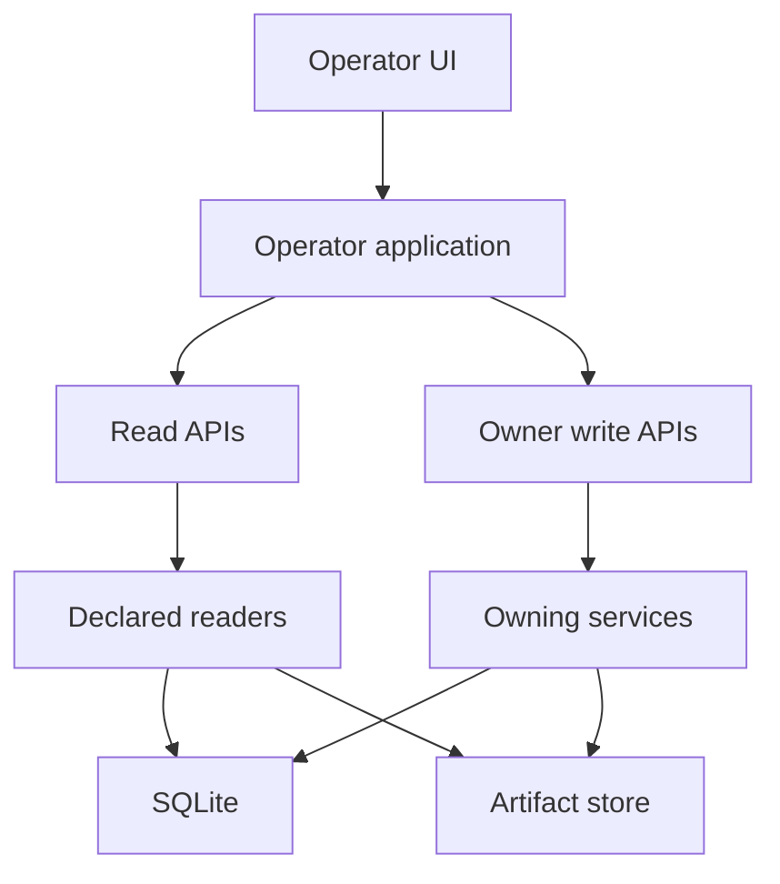

# Five-Module Monolith and Write Boundaries

**Checked main SHA:** `2b44e4bcf75ac3bfd2a5d3a0de679a0fcb1a48ad`

The module, API, and persistence code described here is merged on `main` at that SHA. Baseline-only capabilities remain planned; this delivery standing establishes neither deployment nor operational acceptance.

This is one TypeScript modular monolith: Foundation, Analysis, Orchestrator, Flow, and Governance share one authoritative SQLite database. A module writes its own state through its application service. A different module may consume verified state through the owner's declared reader, but does not write the owner's tables directly ([`AGENTS.md`](../../AGENTS.md#L27-L35); [`ARCHITECTURE.md`](../../ARCHITECTURE.md#L96-L123)).

This is the intended crossing point: composition roots supply reader adapters to dependent services; they do not create peer-table write access.

## Ownership map

| Module | Owns its writes | Cross-module read boundary |
|---|---|---|
| **Foundation** | source, evidence, data-pack, research-document, and source-package material | `FoundationDataPackReader`, `FoundationResearchPackReader`, `FoundationSourcePackageReader` |
| **Analysis** | analysis results, reports, normalized inputs, and research-automation records | `AnalysisResultReader` and report-related readers |
| **Orchestrator** | analysis-backed proposals | `OrchestratorAnalysisBackedProposalReader` |
| **Flow** | workspaces, candidates, baskets, plans, clearances, STP, and content records | Flow workspace, candidate, basket, clearance, and locked-STP readers |
| **Governance** | proposal, candidate, and product decision records | Governance decision and status readers |

The module entrypoints export the services and reader adapters in this map ([Foundation](../../src/modules/foundation/index.ts#L1-L50), [Analysis](../../src/modules/analysis/index.ts#L1-L182), [Orchestrator](../../src/modules/orchestrator/index.ts#L1-L16), [Flow](../../src/modules/flow/index.ts#L1-L157), [Governance](../../src/modules/governance/index.ts#L1-L74)). Module names are ownership boundaries inside the application, not separately deployed services ([`ARCHITECTURE.md`](../../ARCHITECTURE.md#L100-L109)).

### Declared readers are the integration contract

The concrete composition roots illustrate the rule. `openOwnerApi` constructs Flow services and passes Governance reader adapters at their dependency points. It also constructs Analysis report services with Foundation source-package and Flow workspace readers ([`src/api/owner-api.ts`](../../src/api/owner-api.ts#L64-L101)). The read-side applications use the same pattern: workspace views are rebuilt through Flow and Governance readers, while report views receive Foundation and Flow readers ([`src/api/workspace-api.ts`](../../src/api/workspace-api.ts#L70-L104); [`src/api/report-api.ts`](../../src/api/report-api.ts#L53-L83)).

When adding a cross-module dependency, define or extend the owner-facing reader, inject it at a composition root, and test the consumer through that boundary. Do not make a direct SQL query or foreign-key dependency into another module's business tables. Use CodeGraph to find affected integrations before changing an exported service or reader.

## SQLite and artifacts

SQLite is the operational source of truth, including artifact manifests and the ledger rows that reference them. Artifact bytes live in a separate content-addressed store; the foundational manifest records the digest, byte size, media type, safe relative path, acquisition time, contract version, and retention state ([`migrations/0001_foundation.sql`](../../migrations/0001_foundation.sql#L40-L65); [`ARCHITECTURE.md`](../../ARCHITECTURE.md#L319-L338)). Consequently, a new persisted artifact needs both its bytes and a manifest-backed digest reference; a filename is not its identity.

Some domain records deliberately preserve history with database constraints. For example, report-version rows and their source/artifact memberships reject mutation and deletion, while research-automation runs use guarded revisions and cannot be deleted ([`migrations/0030_analysis_report_versions.sql`](../../migrations/0030_analysis_report_versions.sql#L18-L116); [`migrations/0038_research_automation.sql`](../../migrations/0038_research_automation.sql#L37-L97)). Read the owning service and its migration before choosing a state-change strategy; not every table has the same transition model.

### Schema changes

Migrations are contiguous numbered SQL files. `applyMigrations` verifies the recorded version/name/checksum sequence and `PRAGMA user_version`, then applies each pending migration, ledger entry, and version update within `BEGIN IMMEDIATE`/`COMMIT` ([`src/platform/db/migrations.ts`](../../src/platform/db/migrations.ts#L24-L107)). Add a forward migration rather than editing an applied file. The operator app independently refuses to start when either the migration ledger or `user_version` is behind the available head ([`src/api/operator-app.ts`](../../src/api/operator-app.ts#L286-L313)).

## Composition roots and API authority

`openOperatorApp` is the top-level HTTP composition root. It checks the schema before opening applications; opens workspace, report, and content read applications; opens owner-side applications only when owner writes are enabled; and routes `/api/...`, `/owner-api/...`, or static frontend requests accordingly ([`src/api/operator-app.ts`](../../src/api/operator-app.ts#L147-L247)). The public API barrel exports that root alongside the workspace and owner constructors ([`src/api/index.ts`](../../src/api/index.ts#L1-L19)).

| Surface | Boundary |
|---|---|
| `/api/...` | Workspace and report applications open SQLite `readonly` and enable `query_only`; they use a content-addressed store to reconstruct verified reads ([`src/api/workspace-api.ts`](../../src/api/workspace-api.ts#L70-L104); [`src/api/report-api.ts`](../../src/api/report-api.ts#L53-L83)). |
| `/owner-api/...` | The operator root creates this mutation surface only with owner writes enabled; `openOwnerApi` builds writable owning services and a request-scoped artifact store ([`src/api/operator-app.ts`](../../src/api/operator-app.ts#L179-L207); [`src/api/owner-api.ts`](../../src/api/owner-api.ts#L64-L101)). |

A write-enabled operator acquires the exclusive executor lock before database preparation; non-writing viewers do not. Lock acquisition fails if a lock file already exists, leaving recovery explicit rather than breaking exclusivity ([`src/api/operator-app.ts`](../../src/api/operator-app.ts#L167-L171); [`src/api/executor-lock.ts`](../../src/api/executor-lock.ts#L39-L88)). Focused integration coverage exercises the disabled/enabled owner surface and verifies that read/static requests do not alter database bytes ([`tests/integration/operator-app.test.ts`](../../tests/integration/operator-app.test.ts#L36-L78)).

## Safe change path

1. Identify the owning module and place its schema, validation, transition, and artifact publication behind that module's service.
2. For another module's state, request a narrow verified reader from its owner and wire it in a composition root.
3. Keep SQLite and artifacts paired: publish bytes through the appropriate store and persist the manifest-backed digest in the owning ledger.
4. Put queries in read-only applications; put mutations in the owner-side composition with its authorization and artifact lifecycle.
5. Add or update the focused integration test that crosses the boundary, then use CodeGraph to review the export's real integration reach.

For related guidance, see [Runtime and Persistence](../operations/runtime-and-persistence.md), [Decisions and Authority](../operations/decisions-and-authority.md), [Operator Workspaces and Approval](../workflows/operator-workspaces-and-approval.md), and [Verification and Replay](../testing/verification-and-replay.md).
