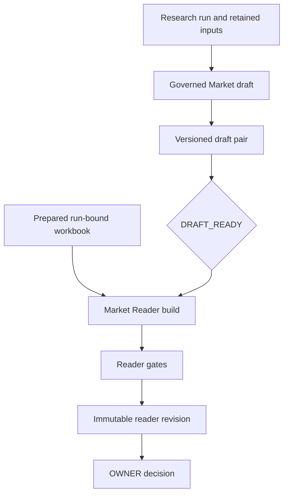

## Two outputs, separate authority

A Market run can yield two deliberately non-interchangeable outputs:

- **Governed automation draft.** This is the 13-section Market artifact produced from a run’s retained scope, collection/capture, source, and method state. It communicates qualified evidence and blocked conditions; it is not an OWNER decision. ([`src/modules/analysis/research-automation/reports.ts`](../../src/modules/analysis/research-automation/reports.ts))
- **Market Reader Report.** This is an OWNER-facing HTML page built after a Market draft is ready. It restates a verified draft alongside one run-bound prepared product-list workbook, then records a separate OWNER approval or rejection. It neither changes the draft nor grants its own data-admission authority. ([`src/modules/analysis/research-automation/reader-report-revisions.ts`](../../src/modules/analysis/research-automation/reader-report-revisions.ts))

The distinction is consequential: draft rendering establishes what governed inputs and method outcomes can be shown; reader review decides only the persisted reader revision. Neither lane may be treated as an upgrade, replacement, or approval of the other.

*The draft renders governed run state; the reader binds that ready draft to a prepared workbook and has its own review lifecycle.*

| Concern | Governed automation draft | Market Reader Report |
| --- | --- | --- |
| Audience and authority | Governed research/evidence surface; partial and blocked states remain explicit | OWNER reading and decision surface; an approval/rejection applies to its revision only |
| Primary inputs | Run, start and scope snapshots, retained captures, source claims, and applicable method snapshots | Latest verified Market draft pair, exactly one run-bound prepared workbook, profile, and optional retained snapshot, cover, or unit specifications |
| Output | Semantic report plus HTML, with section states and citation/technical trace | HTML plus canonical metrics and claims artifacts, revision record, and optional cover/profile/build artifacts |
| Source and worker boundary | Renders existing governed state rather than admitting inputs itself | Does not collect, call a provider, admit a source, mutate the draft, or wake the worker |
| Versioning | Retained markers select historical rendering semantics | Sequential immutable revisions; an exact request retry returns the same revision |

## Governed automation-draft lane

`buildResearchAutomationReport(input, 'MARKET')` first verifies run, scope, collection, and source/method lineage. It then dispatches Market sections from the runtime catalog and produces both semantic data and HTML. ([`src/modules/analysis/research-automation/reports.ts`](../../src/modules/analysis/research-automation/reports.ts))

Each section is explicitly represented as `SOURCE_CONTEXT`, `SOURCE_TABLE`, `EVIDENCE_INVENTORY`, `METHOD_OUTPUT`, `METHOD_NO_USABLE_RECORDS`, or `BLOCKED`; a retained source or failed method is therefore not silently converted into an analytical result or zero. The semantic artifact carries rendered sections, limitations, captures, method snapshots, completion information, citations, and renderer identity. ([`src/modules/analysis/research-automation/reports.ts`](../../src/modules/analysis/research-automation/reports.ts))

The HTML is a governed evidence/status rendering, not a template that recomputes a market analysis. Citation registration occurs while sections render, preserves document order, and retains technical provenance separately from reader-safe citation text. ([`src/modules/analysis/research-automation/reports.ts`](../../src/modules/analysis/research-automation/reports.ts))

Current presentation additions are selected only when their retained inputs are present; historical marker-free reports retain their saved rendering path rather than silently acquiring a newer interpretation. ([`src/modules/analysis/research-automation/reports.ts`](../../src/modules/analysis/research-automation/reports.ts))

## OWNER-facing reader lane

The service entrypoints are `buildReaderReport`, `buildReaderReportFromUnitSpecs`, `prepareReaderUnitSpecs`, `listReaderReports`, `readReaderReport`, and `decideReaderReport`. The API exposes reader list and HTML reads under the research-automation run routes, while build, unit-spec intake, and decision routes require configured OWNER authentication; a reader build explicitly does not wake the research worker. ([`src/modules/analysis/research-automation/service.ts`](../../src/modules/analysis/research-automation/service.ts), [`src/api/research-automation-api.ts`](../../src/api/research-automation-api.ts))

A build requires a `DRAFT_READY` run, reads the verified Market draft pair and its semantic artifact, and uses the finalized `metric/export.xlsx` bytes from the prepared package bound to that run. It checks the workbook package and measurement period before constructing reader input. ([`src/modules/analysis/research-automation/service.ts`](../../src/modules/analysis/research-automation/service.ts), [`src/modules/analysis/research-automation/reader-report-revisions.ts`](../../src/modules/analysis/research-automation/reader-report-revisions.ts))

The reader contract validates profile rules, row identity, declared platforms, per-platform breakdowns, period order, and row cap. Snapshot input is digest-verified; retained unit-price observations are checked against retained bytes, locators, listing/variant correspondence, and duplicate rules before display. ([`src/modules/analysis/reader-report/build.ts`](../../src/modules/analysis/reader-report/build.ts), [`src/modules/analysis/research-automation/reader-report-revisions.ts`](../../src/modules/analysis/research-automation/reader-report-revisions.ts))

The reader carries the draft’s blocked/collection limitations forward in plain language and does not expose raw limitation codes or source-provider names in the page. Its reader-facing citation register can cite workbook rows, retained captures, and safe HTTPS web pages, while provider and diagnostic provenance remain internal. ([`src/modules/analysis/research-automation/reader-report-revisions.ts`](../../src/modules/analysis/research-automation/reader-report-revisions.ts), [`src/modules/analysis/reader-report/market-template.ts`](../../src/modules/analysis/reader-report/market-template.ts))

### Rendering branches and the platform boundary

The regular build stores reader input `1.3.0` and builder `reader-report-market-v3`; the retained-unit-spec route stores input `1.4.0` and `reader-report-market-v4`. `buildMarketReport` routes `1.4.0` to the current v2 template, and also uses that template for `1.2.0`/`1.3.0` inputs when the legacy scopes are absent; other historical inputs retain the legacy template branch. ([`src/modules/analysis/research-automation/reader-report-revisions.ts`](../../src/modules/analysis/research-automation/reader-report-revisions.ts), [`src/modules/analysis/reader-report/market-template.ts`](../../src/modules/analysis/reader-report/market-template.ts))

For current `1.2.0`, `1.3.0`, and `1.4.0` inputs, metric computation keeps platform scopes separate and reconciliation is per-platform. Legacy inputs can construct `both.*` arithmetic when two platforms are present: **code differs from [rule 3](../../docs/research/ultimate-method/ultimate-method-30-sections.md#2-quy-tắc-dùng-chung-áp-cho-cả-30-section)** and **code differs from [rule L5](../../docs/research/ultimate-method/ultimate-method-30-sections.md#21-làm-rõ-khi-áp-cho-insight-mới-ở-v11)**. This historical divergence must not be confused with the current per-platform behavior in [`src/modules/analysis/reader-report/build.ts`](../../src/modules/analysis/reader-report/build.ts).

### Fail-closed publication

`publishReaderReport` runs structural/content lint, rejects literal narrative numbers, and verifies that numbers narrated in HTML come from the metric bundle. Any failure raises `ReaderReportGateError` before HTML, metrics, or claims are written. ([`src/modules/analysis/reader-report/build.ts`](../../src/modules/analysis/reader-report/build.ts))

On success, the lane content-addresses HTML, canonical metric JSON, and claims JSON; claims retain the HTML/metric SHA-256 values, used metric IDs, narrative templates, and lint results. The current retained-unit-spec build enables visible-text rules; the ordinary build retains its versioned behavior. ([`src/modules/analysis/reader-report/build.ts`](../../src/modules/analysis/reader-report/build.ts), [`src/modules/analysis/research-automation/reader-report-revisions.ts`](../../src/modules/analysis/research-automation/reader-report-revisions.ts))

## Revision persistence and decision lifecycle

`analysis_reader_report_revisions` binds each revision to workspace/run, draft-pair digest, metric package, platform set, profile status, input/profile/cover and output artifacts, builder version, actor, and time. Database triggers permit inserts only for a `DRAFT_READY` run and the next gap-free revision number, and prohibit updates/deletes. ([`migrations/0048_analysis_reader_report_revisions.sql`](../../migrations/0048_analysis_reader_report_revisions.sql))

An undecided newest revision projects as `PENDING_OWNER_REVIEW`; an older undecided one is `SUPERSEDED`; a decision projects as `APPROVED` or `REJECTED`. Decisions are append-only and only the newest revision can receive one. Once the newest revision is approved, a further build is rejected. ([`src/modules/analysis/research-automation/reader-report-revisions.ts`](../../src/modules/analysis/research-automation/reader-report-revisions.ts), [`migrations/0048_analysis_reader_report_revisions.sql`](../../migrations/0048_analysis_reader_report_revisions.sql))

A request key is an exact retry only when request digest, workspace/run, and actor agree; it returns the existing revision. A new request can create a later revision with identical HTML bytes, because review state belongs to the revision record. Reads revalidate active manifest metadata, canonical artifact location, size, media type, and SHA-256 before returning HTML. ([`src/modules/analysis/research-automation/reader-report-revisions.ts`](../../src/modules/analysis/research-automation/reader-report-revisions.ts))

## Bounded delivery status

This page was checked against main SHA `2b44e4bcf75ac3bfd2a5d3a0de679a0fcb1a48ad`. The status record lists bounded merged reader slices for per-platform/missing-value handling, retained-spec unit prices and findings, visible-text lint on the new reader branch, and authenticated retained-spec intake; historical PR and merge SHAs document those slices, not current deployment or acceptance. ([`docs/STATUS.md`](../../docs/STATUS.md), [`docs/tasks/ultimate-v1.11-tdn-sync-plan.md`](../../docs/tasks/ultimate-v1.11-tdn-sync-plan.md))

Planned remainder includes the full shared visible-text-lint scope and resolution of when positive cross-platform totals are eligible. The status and plan explicitly do not establish full alignment, deployment, staging/provider execution, or acceptance. ([`docs/STATUS.md`](../../docs/STATUS.md), [`docs/tasks/ultimate-v1.11-tdn-sync-plan.md`](../../docs/tasks/ultimate-v1.11-tdn-sync-plan.md))

## Focused change and test guide

Change the draft lane by preserving section-state meaning, retained-input lineage, semantic artifact/citation trace, and historical renderer dispatch. Change the reader lane by preserving its ready-draft/workbook binding, input contract, metric/narrative gates, immutable revision persistence, and exact-retry behavior. ([`src/modules/analysis/research-automation/reports.ts`](../../src/modules/analysis/research-automation/reports.ts), [`src/modules/analysis/research-automation/reader-report-revisions.ts`](../../src/modules/analysis/research-automation/reader-report-revisions.ts))

Focused coverage in [`tests/integration/research-reader-report.test.ts`](../../tests/integration/research-reader-report.test.ts) exercises ready-run gating, draft/workbook bindings, exact retries, lifecycle immutability, OWNER decisions, provider-name suppression, and authenticated unit-spec intake. [`tests/unit/reader-report-build.test.ts`](../../tests/unit/reader-report-build.test.ts) covers input validation, platform handling, deterministic artifacts, and fail-closed publication.

See also [Thirty Report Sections](thirty-report-sections.md), [Data Source Registry](../integrations/data-source-registry.md), [Quickstart](../quickstart.md), [Verification and Replay](../testing/verification-and-replay.md), [Research Report Lifecycle](../workflows/research-report-lifecycle.md), and [Ultimate Alignment Packages](../workflows/ultimate-alignment-packages.md).
