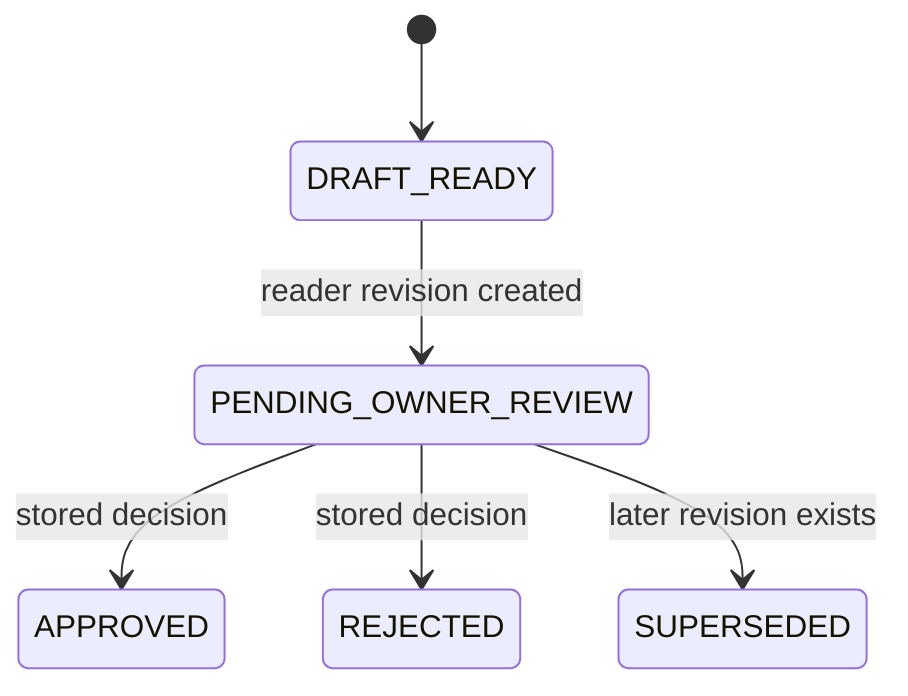

## Scope and status

This is a translation and orientation glossary, not business-policy text. For method terminology, use the linked Ultimate identifier rather than treating this page as a rule source. Implementation status and runtime labels below describe code behavior separately from business authority.

**Checked main SHA:** `2b44e4bcf75ac3bfd2a5d3a0de679a0fcb1a48ad`.

Unless marked **planned**, code behavior below is **merged on main** at that checked SHA.

## Evidence and source vocabulary

| Vietnamese term | English rendering | Orientation |
|---|---|---|
| **bằng chứng nguồn** | source evidence | Retained source material and provenance. |
| **tính toán tái lập được** | reproducible calculation | A result that can be reproduced from retained inputs. |
| **diễn giải AI** | AI interpretation | A separately identified analytical layer. |
| **quyết định con người / chủ duyệt** | human decision / owner decision | A recorded human disposition. |
| **truy nguồn** | provenance / traceability | The link from a claim, number, or quotation to source material and location. |
| **bản ghi** | record | One source-located observation. |
| `EvidenceRecordRef` | evidence-record reference | Technical identifier for an evidence record; retain the identifier in English. See [Ultimate rule 2](../../docs/research/ultimate-method/ultimate-method-30-sections.md#2-quy-tắc-dùng-chung-áp-cho-cả-30-section). |
| **tập mẫu / trong mẫu** | sample / within the sample | The observed frame described by a report. |
| **câu trích nguyên văn** | verbatim quote | Source wording accompanied by its location. |
| **thẻ bằng chứng** | evidence card | A traceable evidence unit. See Ultimate [E4](../../docs/research/ultimate-method/ultimate-method-30-sections.md#22-ngoại-lệ-đã-được-chủ-duyệt). |
| **bộ mã / codebook** | codebook | A versioned classification taxonomy. See Ultimate [rule 8](../../docs/research/ultimate-method/ultimate-method-30-sections.md#2-quy-tắc-dùng-chung-áp-cho-cả-30-section) and [L3](../../docs/research/ultimate-method/ultimate-method-30-sections.md#21-làm-rõ-khi-áp-cho-insight-mới-ở-v11). |
| **lọc nghĩa** | semantic disambiguation filter | Keyword-meaning handling identified by Ultimate [L9](../../docs/research/ultimate-method/ultimate-method-30-sections.md#21-làm-rõ-khi-áp-cho-insight-mới-ở-v11). |

### Value and source qualifiers

| Vietnamese label | English rendering |
|---|---|
| **thiếu** | missing |
| **0 / bằng 0** | observed zero |
| **chưa rõ / UNKNOWN** | unknown |
| **ước tính** | estimate |
| **sơ bộ** | preliminary |
| **chính thức** | official |
| **hạng tin cậy** | reliability tier |
| **độ đại diện** | representativeness |

Reliability tier describes fidelity to the source; representativeness describes the sample frame. The source registry treats them as separate axes. See [Input data sources, §1](../../docs/research/ultimate-method/input-data-sources-30-sections.md#1-thang-đánh-giá-nguồn).

### Voices and source readiness

| Vietnamese term | English rendering | Orientation |
|---|---|---|
| **lời khách** | customer voice | Material attributed to buyers or customers. See Ultimate [L10](../../docs/research/ultimate-method/ultimate-method-30-sections.md#21-làm-rõ-khi-áp-cho-insight-mới-ở-v11). |
| **lời người bán** | seller voice | Material attributed to a seller or brand. |
| **phản ứng thị trường** | market response | Observed market signals. |
| **nguồn dữ liệu đầu vào** | input data source | A registered source, commonly identified by an `S` ID. |
| **nhật ký chi phí** | cost log | A record of source usage, cost, and time; see Ultimate [E14](../../docs/research/ultimate-method/ultimate-method-30-sections.md#22-ngoại-lệ-đã-được-chủ-duyệt). |
| **Đang dùng** | in use | Source-registry readiness status. |
| **Đã test** | tested | Source-registry readiness status with test results. |
| **Chờ test** | awaiting test | Source-registry readiness status with a test scenario. |
| **Đề xuất** | proposed | Source-registry readiness status. |
| **Không dùng** | not used | Source-registry readiness status. |

Source readiness, reliability, representativeness, and report review are different classifications. See [Input data sources, §2](../../docs/research/ultimate-method/input-data-sources-30-sections.md#2-danh-mục-nguồn).

## Report lanes and state labels

| Vietnamese term / code | English rendering | Code-oriented meaning |
|---|---|---|
| **Báo cáo thị trường** | Market Report | `M01`–`M13` report family. |
| **Báo cáo Insight** | Insight Report | `I01`–`I17` report family. |
| **bản nháp tự động** | governed automation draft | Report artifact with semantic state `PARTIAL_UNREVIEWED_DRAFT`. |
| **bản đọc** | reader report | Owner-facing Market HTML revision. |
| **bản nháp** | draft | Draft report terminology; see Ultimate [L3](../../docs/research/ultimate-method/ultimate-method-30-sections.md#21-làm-rõ-khi-áp-cho-insight-mới-ở-v11). |
| **bản phát hành** | released report | Release terminology; see Ultimate [L3](../../docs/research/ultimate-method/ultimate-method-30-sections.md#21-làm-rõ-khi-áp-cho-insight-mới-ở-v11). |
| **đề xuất, chờ chủ duyệt** | proposed, pending owner approval | A pending proposal label; see Ultimate [E2](../../docs/research/ultimate-method/ultimate-method-30-sections.md#22-ngoại-lệ-đã-được-chủ-duyệt), [E6](../../docs/research/ultimate-method/ultimate-method-30-sections.md#22-ngoại-lệ-đã-được-chủ-duyệt), or [L3](../../docs/research/ultimate-method/ultimate-method-30-sections.md#21-làm-rõ-khi-áp-cho-insight-mới-ở-v11) as applicable. |
| **chủ duyệt / OWNER** | owner / OWNER actor | Code role used by reader-revision decision handling. |
| `DRAFT_READY` | draft ready | Terminal research-run status. |
| `FAILED` | failed | Terminal research-run status. |
| `CANCELLED` | cancelled | Terminal research-run status. |
| `INTERRUPTED` | interrupted | Terminal research-run status. |
| `PENDING_OWNER_REVIEW` | pending owner review | Projected state for the newest undecided reader revision. |
| `SUPERSEDED` | superseded | Projected state for an older undecided reader revision. |
| `APPROVED` / `REJECTED` | approved / rejected | Stored reader-revision decision. |

*This diagram shows code-state projection for a reader revision after a draft-ready run; it does not define business authority.*

**Merged on main at the checked SHA:** `TERMINAL_STATUSES` contains `DRAFT_READY`, `FAILED`, `CANCELLED`, and `INTERRUPTED`; reader projection selects `PENDING_OWNER_REVIEW`, `SUPERSEDED`, or a stored decision; and the governed automation report artifact is `PARTIAL_UNREVIEWED_DRAFT`. See [`model.ts`](../../src/modules/analysis/research-automation/model.ts#L15-L20), [`reader-report-revisions.ts`](../../src/modules/analysis/research-automation/reader-report-revisions.ts#L349-L359), and [`reports.ts`](../../src/modules/analysis/research-automation/reports.ts#L719-L741). For lane boundaries, see [Market Report Lanes](market-report-lanes.md) and [Research-to-Report Lifecycle](../workflows/research-report-lifecycle.md).

## Automation and reader terms

| Code or Vietnamese term | English rendering | Code-oriented meaning |
|---|---|---|
| `StartSnapshot` | start snapshot | Frozen request identity before a run exists. |
| `ScopeSnapshot` | scope snapshot | Persisted scope including selected products and peer products. |
| `StepResultDocument` | step-result document | Canonical normalized source-step outcome. |
| **capture / bản chụp thu thập** | capture | Raw-response artifact retained separately from the normalized outcome. |
| **giới hạn nguồn** | source limitation | Typed source condition with code, optional provider, and message. |
| `SUCCEEDED`, `PARTIAL`, `UNAVAILABLE`, `FAILED`, `CANCELLED`, `INTERRUPTED` | source-step outcomes | `StepResultDocument.outcome` vocabulary. |
| **tài liệu nguồn / nguồn trích dẫn** | source / citation | Internal provenance and reader-facing citation are separate representations. |

**Merged on main at the checked SHA:** the automation model defines the two snapshots, retains a normalized `StepResultDocument` separately from `CaptureRecord`, and gives source-step outcomes explicit values. The Market reader template masks provider names and only retains citation candidates with safe non-provider HTTPS URLs. See [`model.ts`](../../src/modules/analysis/research-automation/model.ts#L34-L71), [`model.ts`](../../src/modules/analysis/research-automation/model.ts#L100-L162), and [`market-template.ts`](../../src/modules/analysis/reader-report/market-template.ts#L55-L75).

## Delivery-standing vocabulary

| Label | Meaning |
|---|---|
| **Merged on main** | Implementation present at the checked SHA. |
| **Open PR** | Implementation proposed in an open pull request; not mainline behavior. |
| **Planned** | Documented delivery work, not an asserted implementation. |
| `EXISTING_BOUNDED` | Ultimate Method status identifier. |
| `PROPOSED + BUSINESS_REVIEWED` | Ultimate Method status identifier. |
| `OWNER_DECISION_PENDING` | Ultimate Method status identifier. |
| `BLOCKED` | Ultimate Method status identifier. |

The Ultimate/TDN materials distinguish business-method documentation from implementation. **Planned:** the alignment README lists [E14](../../docs/research/ultimate-method/ultimate-method-30-sections.md#22-ngoại-lệ-đã-được-chủ-duyệt) synchronization among remaining work; that identifier is not an implementation-state label. See [Ultimate/TDN separation](../../docs/research/ultimate-method/README.md#tóm-tắt-cho-chủ-dự-án) and [alignment items](../../docs/research/ultimate-method/README.md#từ-ultimate-v11-đến-v112-070810).

## Related references

- [Thirty Report Sections](thirty-report-sections.md)
- [Market Report Lanes](market-report-lanes.md)
- [Owner Decisions, ADRs, and Change Authority](../operations/decisions-and-authority.md)
- [Research-to-Report Lifecycle](../workflows/research-report-lifecycle.md)
- [Quickstart](../quickstart.md)
