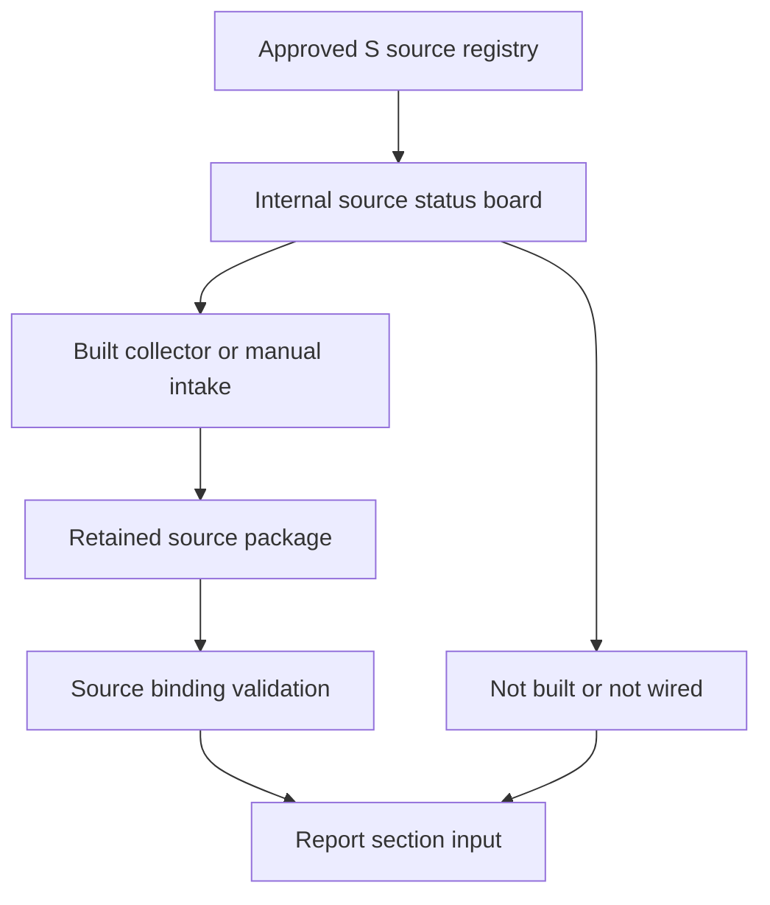

# 30-Section Input Data Sources and Collector Integration

This page mirrors the approved S01–S27 inventory for implementation work. It distinguishes registry approval from a built collector, retained input, run wiring, or report use. The canonical source registry remains [Input data sources for 30 sections](../../docs/research/ultimate-method/input-data-sources-30-sections.md); Ultimate references on this page are IDs and links only.

**Checked main SHA:** `2b44e4bcf75ac3bfd2a5d3a0de679a0fcb1a48ad`.

Delivery standing is limited to **merged on main**, **open PR**, or **planned for delivery**; a merged board or package does not make a planned collector active. See [STATUS](../../docs/STATUS.md#ultimate-alignment--implementation-run-08102026) and the [sync-plan implementation update](../../docs/tasks/ultimate-v1.11-tdn-sync-plan.md#verified-merged-implementation-08102026).

## Registry-to-report boundary

The canonical registry owns source ID, tier, representativeness, report-facing name, registry standing, and section allocation. Implementation owns collector/package availability and the internal board's readiness state. Ultimate method references: [rules 1–9](../../docs/research/ultimate-method/ultimate-method-30-sections.md#2-quy-tắc-dùng-chung-áp-cho-cả-30-section), [L1–L10](../../docs/research/ultimate-method/ultimate-method-30-sections.md#21-làm-rõ-khi-áp-cho-insight-mới-ở-v11), and [E1–E14](../../docs/research/ultimate-method/ultimate-method-30-sections.md#22-ngoại-lệ-đã-được-chủ-duyệt).

*Registry approval crosses into report input only through an implemented, retained, and validated path; the board can instead expose an unavailable or unwired gap.*

## Board and provider boundary

`SOURCE_REGISTRY` defines eleven internal cards and mirrors their registry IDs, tiers (including mixed-tier detail), group, report name, arrival mode, package placeholder, and build flag. `buildResearchAutomationSourceStatus` derives a card state from executor availability, module build state, configuration, run wiring, and stored workspace activity. It reads configuration/history only and does not return credential values. `NOT_BUILT` takes precedence for an unbuilt module; executor-disabled takes precedence over every card state. [Source status implementation](../../src/modules/analysis/research-automation/source-status.ts) · [focused integration test](../../tests/integration/research-automation-source-status.test.ts)

The automation provider port has a separate lifecycle role. Quick search is a recent snapshot, whereas collection uses the requested period. Provider captures retain secret-free request/response metadata and record ambiguous paid outcomes without automatic retry. The binding adapter turns provider results into lifecycle step documents; failed normalization yields a failed step while keeping the provider exchange result available to the lifecycle owner. [Provider contract](../../src/modules/analysis/research-automation/providers.ts) · [source binding](../../src/modules/analysis/research-automation/source-binding.ts)

## Approved registry and delivery standing

**Standing terms:** **merged on main** identifies code or board capability recorded in the checked implementation update; **planned for delivery** identifies an approved source without a built collector/package delivery in this page's evidence. A card's `READY`, `MANUAL_IMPORT`, `CONFIGURED_NOT_WIRED`, or `NOT_BUILT` state is evaluated at request time and is not a statement that data has been collected.

| ID | Approved source | Tier · representativeness | Registry standing | Section allocation | Collector/package standing |
|---|---|---|---|---|---|
| S01 | Marketplace sales data | C · medium | In use | M02–M10, M13 | Metric card: merged on main, manual import |
| S02 | Video commerce, creators, products | C · medium | Partly in use | M02, M05, M07–M08 | Kalodata and video-file cards: merged on main |
| S03 | Supplier and company import/export data | C · medium | Not usable | M06 | No mapped collector; planned |
| S04 | Seller product pages | B · medium | In use | M06–M08, I07, I13 | Metric card shares S01; manual import |
| S05 | Public Shopee reviews with star rating | B · low | In use | I02, I04–I11, I13 | Apify Shopee collector: merged on main |
| S06 | TikTok Shop reviews | B · low | Proposed | I02, I04–I11, I13 | No mapped collector; planned |
| S07 | Public TikTok video comments | B · low | Tested | I02, I04–I13 | Planned for delivery (P9); current board state `NOT_BUILT` |
| S08 | Public Facebook posts | B · low | Collection paused | I02, I04–I10, I13 | No mapped collector |
| S09 | Instagram posts | B · low | Not currently usable | — | No mapped collector |
| S10 | X posts | B · very low in Vietnam | Tested, secondary only | I05, I10 | No mapped collector |
| S11 | YouTube comments | B · low | Proposed | I02, I05, I10 | No mapped collector |
| S12 | Shop-owner orders, returns, messages, reviews | A · medium for that shop’s customers | Not yet available | I02, I04–I08, I16 | Owner-supplied input; no mapped collector |
| S13 | Recipes and public use guidance | C · low | Proposed | I02 | S19 search route; planned |
| S14 | Seller video speech, visuals, and on-screen text | B · medium within S02 top-video selection | P9 checklist | M07, I12–I13 | Planned for delivery (P9); current board state `NOT_BUILT` |
| S15 | Meta public ad library | B · medium | Tested | M07, I12–I13 | Planned for delivery (U-23); current board state `NOT_BUILT` |
| S16 | TikTok Creative Center prominent ads | B · medium | Tested, failed | M07, I12–I13 | No mapped collector |
| S17 | Google ad library | B · medium | Tested, not usable for its listed check | M07, I12 | No mapped collector |
| S18 | Facebook brand pages | B · medium | Proposed | M07, I13 | No mapped collector |
| S19 | Expanded Google search | Tier follows origin page · low | Awaiting test | M09, I07 | SerpApi card is merged; expanded-search collection is planned (P5) |
| S20 | Google Trends interest, related queries, regions | B · medium | Awaiting test | M05, M09, I10 | SerpApi card: merged on main; run integration planned for delivery (P5) |
| S21 | National Statistics Office data | A · high | Checked | M02, M05–M10, I02, I11–I12 | Planned for delivery (P10); current board state `NOT_BUILT` |
| S22 | Provincial Statistics Office data | A · high by province | Checked | M06 | PageIndex document card: merged on main |
| S23 | World Bank open data | A · high | Approved, not yet collected | M05, M10 | Planned for delivery (P10); current board state `NOT_BUILT` |
| S24 | UN Comtrade official API | A · high by commodity code | Proposed | M06 | No mapped collector |
| S25 | Published industry and company reports | B audited annual reports / C industry surveys · medium | In use for M09 | M09 | PageIndex document card: merged on main |
| S26 | Press and food-safety news | C · low | Proposed | M09, I13 | S19 search route; planned |
| S27 | Historical third-party shop-review scan | C · not specified | Used previously | — | Historical record; no collector |

The registry's report-facing names and source characteristics are also encoded in the report appendix projection. That projection accepts only known registry IDs, produces tier details for S19 and S25, and attaches official attributions for S21–S23; it is distinct from board readiness. [Report source registry](../../src/modules/analysis/source-registry.ts) · [appendix projection](../../src/modules/analysis/source-appendix-projection.ts)

## Implemented collector and intake notes

- **S05 / Apify Shopee — merged on main.** The live collector requires a token and positive charge cap, validates bounded selection, journals start intent before its paid POST, does not retry an uncertain start, bounds page reads, and records actor stop/usage metadata. The optional private intake derives author identifiers with HMAC-SHA256 and does not retain the raw-ID mapping. [Collector](../../src/platform/collectors/apify-shopee.ts) · [private intake](../../src/platform/collectors/shopee-private-intake.ts)
- **S02 / Kalodata video file — merged on main.** The intake accepts bounded CSV/XLSX exports with exact video or creator headers. Null input and zero denominators produce null derived values, and source preparation is not admission. [Kalodata video intake](../../src/modules/analysis/research-automation/kalodata-video-intake.ts)
- **S19/S20 / SerpApi helpers — partial implementation.** Expanded-search query building and the Trends reader are explicitly offline and not wired into a run. Trends normalizes up to five keywords and plans no more than four requests; `SearchCallBudget` skips an exhausted call rather than queueing, deferring, or retrying it. [Expanded queries](../../src/modules/analysis/research-automation/expanded-search-queries.ts) · [Trends reader](../../src/modules/analysis/research-automation/search-trends.ts)

## Section allocation

The compact allocation below preserves the canonical primary/secondary layout. “Synthesis” has no independent source; “every source actually used” is runtime-dependent.

| Section | Primary | Secondary / Ultimate IDs |
|---|---|---|
| M01 | Synthesis | [E3](../../docs/research/ultimate-method/ultimate-method-30-sections.md#22-ngoại-lệ-đã-được-chủ-duyệt) |
| M02 | S01, S02 | S21 |
| M03 | S01 | — |
| M04 | S01 | — |
| M05 | S01 | S02, S20, S21, S23; [E10](../../docs/research/ultimate-method/ultimate-method-30-sections.md#22-ngoại-lệ-đã-được-chủ-duyệt) |
| M06 | S01, S03 | S04, S21, S22, S24 |
| M07 | S01, S02 | S04, S14–S18; [E11](../../docs/research/ultimate-method/ultimate-method-30-sections.md#22-ngoại-lệ-đã-được-chủ-duyệt) |
| M08 | S01, S04 | S02, S21; [E1](../../docs/research/ultimate-method/ultimate-method-30-sections.md#22-ngoại-lệ-đã-được-chủ-duyệt), [E9](../../docs/research/ultimate-method/ultimate-method-30-sections.md#22-ngoại-lệ-đã-được-chủ-duyệt) |
| M09 | S21, S25, S26 | S01, S19, S20 |
| M10 | S01 | S21, S23 |
| M11 | Synthesis of M05, M07, I08, I09 | — |
| M12 | Synthesis | [E2](../../docs/research/ultimate-method/ultimate-method-30-sections.md#22-ngoại-lệ-đã-được-chủ-duyệt) |
| M13 | Every source actually used | — |
| Insight conclusion | Synthesis | [E6](../../docs/research/ultimate-method/ultimate-method-30-sections.md#22-ngoại-lệ-đã-được-chủ-duyệt) |
| I01 | — | [E7](../../docs/research/ultimate-method/ultimate-method-30-sections.md#22-ngoại-lệ-đã-được-chủ-duyệt) |
| I02 | S05–S08, S11, S12 | S13, S21; [E4](../../docs/research/ultimate-method/ultimate-method-30-sections.md#22-ngoại-lệ-đã-được-chủ-duyệt), [E5](../../docs/research/ultimate-method/ultimate-method-30-sections.md#22-ngoại-lệ-đã-được-chủ-duyệt) |
| I03 | Every source actually used | — |
| I04 | S05–S08 | S12 |
| I05 | S05–S08 | S10, S11; [L6](../../docs/research/ultimate-method/ultimate-method-30-sections.md#21-làm-rõ-khi-áp-cho-insight-mới-ở-v11) |
| I06 | S05, S08 | S12 |
| I07 | S05–S08 | S04, S19; [L7](../../docs/research/ultimate-method/ultimate-method-30-sections.md#21-làm-rõ-khi-áp-cho-insight-mới-ở-v11) |
| I08 | S05–S08 | S12 |
| I09 | S05–S08 | — |
| I10 | S05–S08 | S10, S11, S20; [L3](../../docs/research/ultimate-method/ultimate-method-30-sections.md#21-làm-rõ-khi-áp-cho-insight-mới-ở-v11) |
| I11 | S05/S06; S05/S07 | S21; [E11](../../docs/research/ultimate-method/ultimate-method-30-sections.md#22-ngoại-lệ-đã-được-chủ-duyệt), [L5](../../docs/research/ultimate-method/ultimate-method-30-sections.md#21-làm-rõ-khi-áp-cho-insight-mới-ở-v11) |
| I12 | S14–S17, S07 | S21 |
| I13 | S05–S08, S14–S16, S18 | S04, S26; [E5](../../docs/research/ultimate-method/ultimate-method-30-sections.md#22-ngoại-lệ-đã-được-chủ-duyệt), [L7](../../docs/research/ultimate-method/ultimate-method-30-sections.md#21-làm-rõ-khi-áp-cho-insight-mới-ở-v11) |
| I14 | Synthesis | — |
| I15 | Synthesis | [E6](../../docs/research/ultimate-method/ultimate-method-30-sections.md#22-ngoại-lệ-đã-được-chủ-duyệt) |
| I16 | S12 | — |
| I17 | Every source actually used | — |

## Extension and verification

Update the canonical registry and its Ultimate references before changing this mirror. A board change belongs with the owning package: add its card metadata, state derivation, activity reader, contract changes, and synthetic coverage together. Tests must continue to assert the eleven-card roster, workspace-scoped history, state precedence, absent-cap handling, and credential suppression. For package ownership and remaining source-board work, use [SYNC-6 / Part B](../../docs/tasks/ultimate-v1.11-tdn-sync-plan.md#phần-b-màn-hình-nguồn-dữ-liệu).

Related reading: [Market Report Lanes](../concepts/market-report-lanes.md), [30 report sections](../concepts/thirty-report-sections.md), [research report lifecycle](../workflows/research-report-lifecycle.md), [alignment packages](../workflows/ultimate-alignment-packages.md), and [verification and replay](../testing/verification-and-replay.md).
