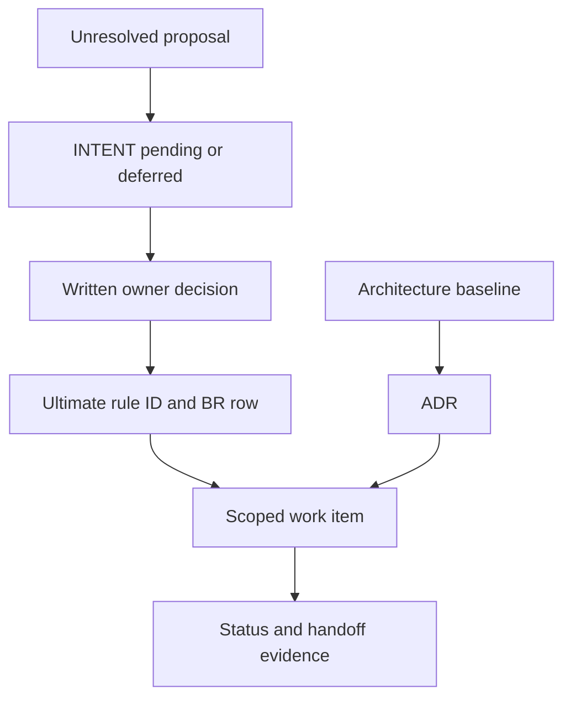

# Owner Decisions, ADRs, and Change Authority

**Checked main SHA:** `2b44e4bcf75ac3bfd2a5d3a0de679a0fcb1a48ad`.

Use this page to identify the record that has authority for a question. Keep business authority, technical decisions, intent, and delivery evidence separate.

## Record map

| Question | Record to consult | How to use it |
|---|---|---|
| What business method currently governs? | [Ultimate Method](../../docs/research/ultimate-method/ultimate-method-30-sections.md) | Link the applicable rule ID; do not restate it here. |
| What changed, who decided, and what is its TDN sync state? | [Ultimate CHANGELOG](../../docs/research/ultimate-method/CHANGELOG.md) | Link the exact `BR-YYYYMMDD-nn` row with the applicable rule ID. A later decision is a new row, not a rewrite of the earlier one. |
| Is an idea accepted, deferred, or unresolved? | [INTENT.md](../../INTENT.md) | Read its labels: **Đã thống nhất** is confirmed, **Để sau** is deferred, and **Chưa chốt** remains unresolved. Intent is not delivery evidence. |
| Has a material technical boundary been decided? | [Architecture ADRs](../../docs/adr/) or the [research-automation ADR index](../../docs/research-automation/adr/README.md) | Read the record’s status, scope, consequences, and supersession notes before changing its boundary. |
| What is the current technical baseline? | [ARCHITECTURE.md](../../ARCHITECTURE.md) | Use it for architecture boundaries and ADR triggers. |
| What has been delivered? | [docs/STATUS.md](../../docs/STATUS.md), linked handoffs, and the [Ultimate alignment plan](../../docs/tasks/ultimate-v1.11-tdn-sync-plan.md) | State delivery only as **merged on main**, **open PR**, or **planned**, with the cited status evidence. |

## Authority and evidence flow

This map shows record ownership, not implementation completion: authority passes into scoped work, while delivery standing is recorded separately.

## Precedence and boundaries

### Business-method authority

For the 30-section method, consult [Ultimate §1](../../docs/research/ultimate-method/ultimate-method-30-sections.md#1-cách-đọc-và-thứ-bậc-thẩm-quyền) as the authority record.

For a business change, cite **both** the Ultimate rule ID and the linked `BR-…` row. Examples of identifiers that must remain pointers rather than rewritten rules include [E14](../../docs/research/ultimate-method/ultimate-method-30-sections.md#22-ngoại-lệ-đã-được-chủ-duyệt), `U-26`, `P6`, and `P9`.

### Technical architecture authority

`ARCHITECTURE.md` is the living implementation baseline. Its architectural-invariant changes require an ADR. An ADR records a technical decision and its consequences; acceptance of an ADR does not itself establish delivery standing.

For general ADRs, use the next numbered record in `docs/adr/`. For research automation, the local ADR index directs authors to add a new record when changing an accepted decision, mark the earlier record as superseded, and retain the historical record.

### Intent is not a silent authorization channel

`INTENT.md` preserves confirmed choices, deliberately deferred work, and unanswered questions. A proposal or **Chưa chốt** item is not a requirement; a deferred item is not current scope. When intent and implementation evidence differ, document the gap rather than changing either record by assumption.

### Delivery evidence is independent

An owner decision, an ADR, or a work plan does not prove delivery. Use the status record and linked handoff evidence, and label each statement only **merged on main**, **open PR**, or **planned**. Do not treat a checklist, acceptance, or an architectural record as a delivery claim.

The alignment plan keeps `U-26`, `U-11`, and `U-32` unresolved. They are work items, not business rules; retain their unresolved status until the owning records change.

## Operating procedure

1. **Classify the question.** Locate the relevant business rule ID, technical boundary, intent label, or work item.
2. **Find the authoritative record.** For business changes, link the Ultimate rule ID and `BR-…` row. For a technical-boundary change, read the ADR and baseline first.
3. **Preserve unresolved scope.** Escalate or record the missing owner decision; do not convert a proposal, `U-…`, `P…`, `B-…`, or `SYNC-…` identifier into a rule.
4. **Append rather than rewrite.** Record a changed business decision in a new Ultimate version and `BR-…` row; supersede an architectural decision with a new ADR.
5. **Report delivery separately.** Cite the status or handoff and choose exactly one standing: **merged on main**, **open PR**, or **planned**.

## Evidence-layer guardrail for reports

[ADR 0005](../../docs/adr/0005-report-evidence-and-decision-ledger.md) keeps source evidence, deterministic calculations, AI interpretation, and human decisions distinct. In report work, do not use an AI interpretation, framework approval, or renderer output as a human decision or as source evidence. Human review remains an append-only decision against an exact semantic version.

## Focused checks before changing a record

- For a business change, locate the Ultimate rule ID and exact `BR-…` row.
- For an architecture change, re-read `ARCHITECTURE.md` and the affected ADR, including supersession information.
- For a proposal, check its `INTENT.md` label before planning work.
- For delivery language, verify the status record and handoff, then use only the three delivery standings above.
- Keep evidence, calculation, interpretation, and human-decision records distinct in report changes.

## Related pages

- [Five-Module Monolith and Write Boundaries](../architecture/modular-monolith.md)
- [Vietnamese Business Glossary](../concepts/vietnamese-business-glossary.md)
- [Quickstart](../quickstart.md)
- [Operator Workspaces and Approval](../workflows/operator-workspaces-and-approval.md)
- [Ultimate Alignment Packages](../workflows/ultimate-alignment-packages.md)
