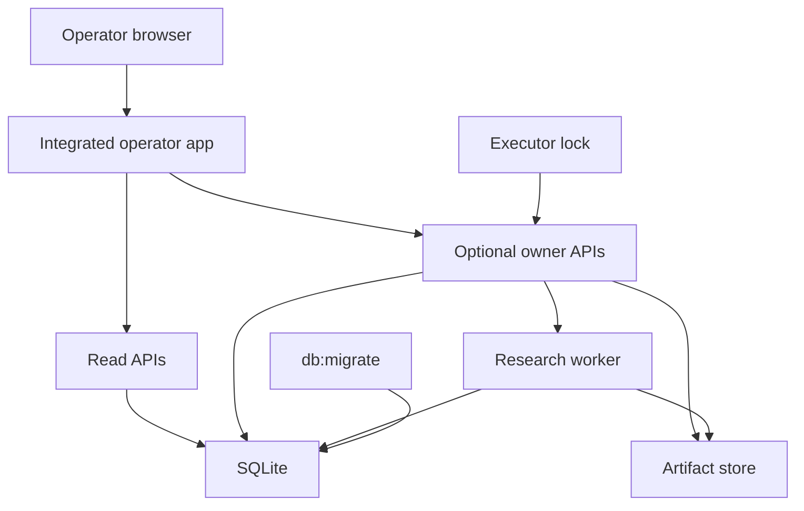

# Runtime, SQLite, Artifacts, and Safe Operations

**Checked main SHA:** `2b44e4bcf75ac3bfd2a5d3a0de679a0fcb1a48ad`  
**Delivery standing:** The entrypoints and controls below are **merged on main**. The separate web/worker topology, backup automation, recovery objectives, and generalized durable-worker capabilities described in [`ARCHITECTURE.md`](../../ARCHITECTURE.md) are **planned** unless a linked implementation says otherwise. This is a description of repository implementation, not deployed behavior or operational acceptance.

See [Modular Monolith](../architecture/modular-monolith.md) for state ownership, [Decisions and Authority](decisions-and-authority.md) for change authority, and [Verification and Replay](../testing/verification-and-replay.md) for the test boundary.

## Runtime composition

Node `24.15.0` exposes three TypeScript launch commands: `npm run operator-app:start`, `npm run workspace-api:start`, and `npm run workspace-owner-api:start`. They are distinct entrypoints using supplied database and artifact locations; their presence does not establish a production topology ([`package.json`](../../package.json#L7-L10), [`package.json`](../../package.json#L35-L49)).

| Entrypoint | Merged-on-main responsibility |
|---|---|
| `scripts/serve-operator-app.ts` | Starts the integrated loopback operator app after configuration, frontend, schema, and executor preflight. Read APIs are always composed; owner-write APIs are composed only with owner writes enabled. |
| `scripts/serve-workspace-api.ts` | Starts the workspace API after requiring database/artifact configuration and a loopback host. |
| `scripts/serve-owner-api.ts` | Requires explicit owner-write enablement plus owner configuration before starting its loopback API. |

This shows the implemented integrated composition. The research worker is created only for the owner handle; a read handle has no worker ([`src/api/operator-app.ts`](../../src/api/operator-app.ts#L167-L208), [`src/api/research-automation-api.ts`](../../src/api/research-automation-api.ts#L184-L267)).

`openOperatorApp` preloads an allowed static distribution before listening, derives an exact same-origin authority, checks the database is at migration head, and routes `/api/` separately from `/owner-api/`. Disabled owner routes return forbidden. The static preload rejects missing, unreadable, linked, dotfile, non-regular, and unsupported frontend entries and verifies `index.html` asset references ([`src/api/operator-app.ts`](../../src/api/operator-app.ts#L147-L247), [`src/api/operator-app.ts`](../../src/api/operator-app.ts#L322-L390)).

### Exposure and configuration boundary

The integrated configuration requires database and artifact-root inputs, accepts only loopback hosts, and validates a TCP port. Owner writes are opt-in and require an actor and strong token, apart from the narrowly restricted process-only local-test mode. That mode requires direct same-origin requests and rejects forwarded headers; it is not evidence for proxy or network exposure ([`src/api/operator-app.ts`](../../src/api/operator-app.ts#L79-L145), [`src/api/operator-app.ts`](../../src/api/operator-app.ts#L322-L335), [`src/api/operator-app.ts`](../../src/api/operator-app.ts#L412-L439)).

Optional R2, provider, PDF, and model features are explicitly configured. R2 requires owner writes, and health reports enabled modes rather than credentials ([`src/api/operator-app.ts`](../../src/api/operator-app.ts#L137-L144), [`src/api/operator-app.ts`](../../src/api/operator-app.ts#L407-L410)). Do not record credentials, tokens, storage locations, or runtime values in this page.

## SQLite and migrations

`openDatabase` resolves and creates the parent directory, creates or restricts the database file to owner-only mode on non-Windows systems, then enables WAL, foreign keys, a default five-second busy timeout, `synchronous = FULL`, migrations, and safe integers. It closes the connection if setup fails ([`src/platform/db/database.ts`](../../src/platform/db/database.ts#L18-L40)). The SQLite integration suite covers fresh setup, idempotence, upgrades, and preservation of earlier ledger data ([`tests/integration/sqlite-foundation.test.ts`](../../tests/integration/sqlite-foundation.test.ts#L56-L124), [`tests/integration/sqlite-foundation.test.ts`](../../tests/integration/sqlite-foundation.test.ts#L126-L283)).

`npm run db:migrate` invokes `scripts/migrate.ts`; it opens the selected database, applies pending migrations through `openDatabase`, prints versions and relevant pragmas, and closes it ([`package.json`](../../package.json#L35-L38), [`scripts/migrate.ts`](../../scripts/migrate.ts#L1-L20)). Migration discovery accepts only contiguous `NNNN_lowercase_name.sql` files and hashes each file. Application refuses a non-empty unledgered database, checksum/ledger disagreement, a database newer than the migration set, or disagreement between `user_version` and the ledger. Each pending SQL change, ledger insert, and version update is one `BEGIN IMMEDIATE` transaction ([`src/platform/db/migrations.ts`](../../src/platform/db/migrations.ts#L24-L107)).

The operator app does **not** migrate on startup: it opens read-only, requires both schema indicators at head, and fails before serving otherwise ([`src/api/operator-app.ts`](../../src/api/operator-app.ts#L286-L313); [`tests/integration/content-ai-operator.test.ts`](../../tests/integration/content-ai-operator.test.ts#L64-L76)). A safe repository-informed sequence is therefore to make a consistent backup, run `npm run db:migrate`, start or restart, then perform a relevant smoke check. Backup creation, scheduling, restore objectives, and rehearsal are **planned**, not implemented commands ([`ARCHITECTURE.md`](../../ARCHITECTURE.md#L515-L535)).

## Serialization and lifecycle

`withDatabaseMutationMutex` serializes application-owned asynchronous mutation workflows by resolved SQLite filename and releases the queue in a `finally` block. It supplements rather than replaces database transactions and constraints ([`src/platform/db/database-mutation-mutex.ts`](../../src/platform/db/database-mutation-mutex.ts#L4-L20)).

For owner execution, a database-adjacent lock is exclusively created, owner-only, and fsynced. Existing locks—including empty, malformed, stale, or other-host locks—block startup unchanged. Canonical database paths and hard-link rejection prevent ordinary aliases from gaining a separate lock identity; manual recovery is the only stale-lock path ([`src/api/executor-lock.ts`](../../src/api/executor-lock.ts#L5-L89), [`tests/integration/content-ai-operator.test.ts`](../../tests/integration/content-ai-operator.test.ts#L78-L156)). An owner executor may mark running content-AI attempts interrupted after schema preflight; viewer mode does not sweep them ([`src/api/operator-app.ts`](../../src/api/operator-app.ts#L286-L319)).

The research worker permits one in-process owner per database. It recovers persisted work before a nonblocking drain, coalesces repeat wake-ups, records drain failure in `lastError`, and on close interrupts active work before awaiting the drain and releasing ownership ([`src/modules/analysis/research-automation/worker.ts`](../../src/modules/analysis/research-automation/worker.ts#L4-L65)). This bounded in-process worker is **merged on main**; separate worker processes and durable leases, retries, backoff, and dead-letter mechanics remain **planned** architecture topology ([`ARCHITECTURE.md`](../../ARCHITECTURE.md#L100-L123)).

The operator launcher shares one close promise for `SIGINT` and `SIGTERM`. Application close stops the server, drains media work, closes automation and API components, then releases the executor lock only if all close steps succeeded; an uncertain shutdown retains the lock ([`scripts/serve-operator-app.ts`](../../scripts/serve-operator-app.ts#L23-L37), [`src/api/operator-app.ts`](../../src/api/operator-app.ts#L249-L275)).

## Artifact integrity and recovery scope

SQLite manifests record SHA-256, size, media type, safe relative path, acquisition and contract metadata, and retention state; evidence records reference manifest digests. Artifact identity is digest-based, not filename-based ([`migrations/0001_foundation.sql`](../../migrations/0001_foundation.sql#L40-L65)). Bounded artifact reads reject invalid limits, absent/non-regular/oversized files, corruption, truncation, and growth while reading. Focused tests cover asynchronous descriptor I/O and closure on success and failure ([`tests/unit/artifact-store-bounded.test.ts`](../../tests/unit/artifact-store-bounded.test.ts#L38-L117), [`tests/unit/artifact-store-bounded.test.ts`](../../tests/unit/artifact-store-bounded.test.ts#L119-L189)).

Research automation re-authenticates retained draft inputs against the exact workspace, run, frozen scope, source-set, and admitted capture records before returning them; manifest registration happens within the mutation mutex ([`src/modules/analysis/research-automation/service.ts`](../../src/modules/analysis/research-automation/service.ts#L444-L485)). The replay compatibility test uses synthetic retained inputs and fixed SHA-256 outputs. It demonstrates that tested compatibility, not byte-identical AI re-execution ([`tests/unit/research-private-replay-compatibility.test.ts`](../../tests/unit/research-private-replay-compatibility.test.ts#L10-L52), [`ARCHITECTURE.md`](../../ARCHITECTURE.md#L396-L403)).

Back up and restore database state and referenced artifact bytes together. The architecture baseline specifies a SQLite-consistent snapshot method rather than copying an active WAL database; it also notes digests detect mismatch but are not administrator-proof immutability ([`ARCHITECTURE.md`](../../ARCHITECTURE.md#L515-L535), [`ARCHITECTURE.md`](../../ARCHITECTURE.md#L319-L338)). Those are **planned** recovery requirements, not evidence of an implemented backup service.

## Operational limits

- Add forward migrations; do not alter applied migration files. Preserve checksum/ledger and head-check behavior.
- Do not delete an executor lock merely because it looks old. Establish that no executor owns it, then follow the documented manual recovery process.
- Keep asynchronous multi-step writes within existing serialization boundaries and retain SQLite transactions, constraints, and manifest registration.
- No claim here establishes a backup schedule, RPO/RTO, off-host destination, restore rehearsal, separate worker deployment, or deployment acceptance.
- Focused repository tests include `tests/integration/sqlite-foundation.test.ts`, `tests/integration/content-ai-operator.test.ts`, and `tests/unit/artifact-store-bounded.test.ts`. This documentation update did not execute them.
