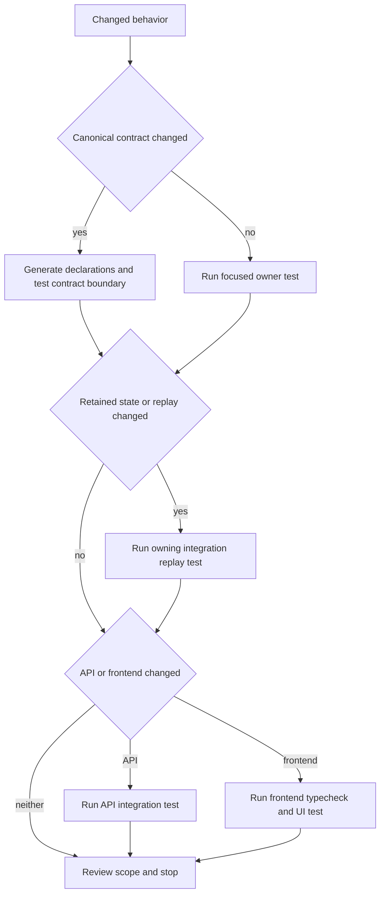
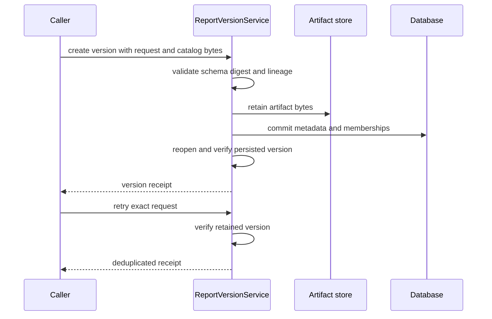

## Scope and evidence status

This page selects validation by the boundary a change crosses, rather than prescribing a full-suite run. The application is a TypeScript modular monolith: JSON Schema is canonical at trust boundaries and AJV validates those boundaries. Start with the project [working rules](../../AGENTS.md), then use the smallest meaningful check and expand when an interface, retained state, transport, or rendered output changes. For ownership context, see [Modular Monolith](../architecture/modular-monolith.md), [Market Report Lanes](../concepts/market-report-lanes.md), and the [research-report lifecycle](../workflows/research-report-lifecycle.md).

**Checked main SHA:** `2b44e4bcf75ac3bfd2a5d3a0de679a0fcb1a48ad`.

| Standing or evidence state | Reference | Meaning |
| --- | --- | --- |
| **MERGED ON MAIN** | `2b44e4bcf75ac3bfd2a5d3a0de679a0fcb1a48ad` | **Delivery standing:** the services, contracts, scripts, and test files described on this page are merged on `main` at the checked SHA. This is not evidence that a check passed or that a deployment or live integration ran. |
| **INSPECTED** | main `2b44e4bcf75ac3bfd2a5d3a0de679a0fcb1a48ad` | **Evidence state, not delivery status:** source, contracts, and focused tests were inspected at that SHA. |
| **NOT EXECUTED** | documentation update | **Check state, not delivery status:** no repository checks were run for this update. In particular, the contract generator was inspected but did not execute checks. This page does not claim test success, deployment, or live provider/model execution. |
| **FIXTURES** | focused tests | Test inputs described here are synthetic, including synthetic tokens and fake transports; they are not commercial data or evidence of a live integration. |

`npm run check` chains contract generation, backend and frontend type checks, frontend build/tests, and backend unit/integration tests. Its component commands are defined in [`package.json`](../../package.json), but their presence is not evidence that they passed. For a release-level change, use the aggregate command; for ordinary work, choose the focused owner first.



*Validation expands only when the changed behavior crosses a contract, retained-state, transport, or UI boundary.*

## Contract boundary: schema first, generated declarations second

The registry in [`scripts/generate-foundation-contract.mjs`](../../scripts/generate-foundation-contract.mjs) compiles listed JSON Schemas to adjacent `.generated.ts` declarations and labels the output as not hand-editable. Edit the schema, regenerate with `npm run contracts:generate`, and review the generated diff; the generator itself is not a validator or test runner.

`ReportVersionService` creates strict AJV validators for the creation and persisted-record contracts before it accepts an untrusted report request ([`report-version-service.ts`](../../src/modules/analysis/report-version-service.ts#L38-L45), [`report-version-create-request.schema.json`](../../contracts/analysis/report-version-create-request.schema.json#L5-L29)). The request is a closed object: version 1 requires a null predecessor, while later versions require a SHA-256 predecessor. The record contract in turn requires immutable identity, workspace/source digests, artifact descriptors, selected sources, and the `NONE`/`UNREVIEWED` initial states ([`report-version-record.schema.json`](../../contracts/analysis/report-version-record.schema.json#L5-L56)).

For an automation revision, the canonical request requires a UUID `requestKey`, `previousPairId`, and an explicit decision for metric and native-review sources; a prepared source is named by package ID ([`automation-report-revision.schema.json`](../../contracts/analysis/automation-report-revision.schema.json#L5-L26)). The public revision API contract represents ordered version pairs and attempt receipts. A receipt has a state of `QUEUED`, `RUNNING`, `COMMITTED`, `FAILED`, or `CANCELLED`, and exposes a pair only when one exists ([`research-automation-revision-api.schema.json`](../../contracts/api/research-automation-revision-api.schema.json#L34-L78)).

**Select this boundary** when changing a schema, canonical response, serializer, or compatibility branch. A narrow contract test should cover both accepted and rejected shapes, especially closed-object behavior and legacy forms that must still replay. If a schema feeds storage, HTTP, or a client, add the corresponding downstream boundary rather than assuming a type declaration proves it.

## Report versions: retain exact inputs and verify the complete replay

`ReportVersionService.createVersion` and `createPreparedVersion` snapshot and digest the request, check the catalog digest, serialize changes under the database mutation mutex, and verify the persisted receipt by reopening the version ([`report-version-service.ts`](../../src/modules/analysis/report-version-service.ts#L180-L185), [`report-version-service.ts`](../../src/modules/analysis/report-version-service.ts#L195-L305), [`report-version-service.ts`](../../src/modules/analysis/report-version-service.ts#L308-L432)). Artifacts are content-addressed; version metadata holds their digest, media type, size, and membership.



*Creation retains a reproducible artifact set; an exact retry verifies it instead of making another historical version.*

A verified read does more than fetch a row. `readVersion` re-reads the request artifact, checks canonical JSON and digest identity, reads every registered artifact, rebuilds expected files, compares exact membership and bytes, validates workspace/source lineage and predecessor chain, then validates the projected record against its schema ([`report-version-service.ts`](../../src/modules/analysis/report-version-service.ts#L444-L553)). `readArtifact` first requires that complete version verification and only then returns a named member ([`report-version-service.ts`](../../src/modules/analysis/report-version-service.ts#L581-L590)). There is no implicit “latest” method on the narrow reader ([`report-version-service.ts`](../../src/modules/analysis/report-version-service.ts#L910-L928)).

Important failure semantics:

- An occupied report/version with different request content conflicts; a new series must begin at version 1 with no predecessor, and later versions must continue the current semantic predecessor ([`report-version-service.ts`](../../src/modules/analysis/report-version-service.ts#L782-L817)).
- An exact retry reports `deduplicated: true` and `databaseMutations: 0`. If the only problem is a missing published file, the retry can rebuild and verify the same bytes without database mutations; corrupt retained bytes are integrity failures and are not overwritten ([`report-version-service.ts`](../../src/modules/analysis/report-version-service.ts#L592-L654)).
- Prepared reports stage request-owned artifacts, verify them before publication, and bind preparation, readiness, retained-section, source, and assembly artifacts into the retained file set ([`report-version-service.ts`](../../src/modules/analysis/report-version-service.ts#L718-L779)).
- A presentation can change `report.html` without changing semantic identity, but the original version's bytes remain its own immutable artifact set. The focused service tests cover that separation ([`tests/integration/report-version-service.test.ts`](../../tests/integration/report-version-service.test.ts#L258-L288), [`tests/integration/prepared-report-version.test.ts`](../../tests/integration/prepared-report-version.test.ts#L54-L124)).

Use [`tests/integration/report-version-service.test.ts`](../../tests/integration/report-version-service.test.ts) for version identity, missing/corrupt artifacts, source-backed replay, and API serving of verified members. Use [`tests/integration/prepared-report-version.test.ts`](../../tests/integration/prepared-report-version.test.ts) when preparation, retained M03 members, staged publication, or prepared assembly changes. These fixtures use temporary SQLite databases, temporary artifact roots, fixed synthetic data, and in-process services; they do not establish production behavior.

## Automation revision: an attempt is not immediately a pair

`ResearchAutomationService` owns run state, captures, retained source sets, report attempts, version pairs, and optional ports. Its constructor accepts source, renderer, collector, transport, clock, UUID, and PageIndex options as explicit seams; absent options remain absent rather than silently activating a provider or model ([`service.ts`](../../src/modules/analysis/research-automation/service.ts#L246-L280), [`service.ts`](../../src/modules/analysis/research-automation/service.ts#L375-L433)). For example, source-keyword drafting returns `MODEL_NOT_CONFIGURED` when there is no configured transport ([`service.ts`](../../src/modules/analysis/research-automation/service.ts#L435-L467)).

A revision request is validated, canonicalized, and request-key deduplicated. Before it creates an attempt, the service verifies the current predecessor pair and its outputs, validates selected retained sources, persists the canonical request/source set, and records one `QUEUED` attempt. A stale `previousPairId`, active attempt, or changed request key fails rather than branching silently ([`service.ts`](../../src/modules/analysis/research-automation/service.ts#L1241-L1353)). Cancellation is likewise request-key idempotent and only changes a `QUEUED` or `RUNNING` attempt to `CANCELLED` ([`service.ts`](../../src/modules/analysis/research-automation/service.ts#L1356-L1382)).

Version and attempt reads revalidate the retained chain. `listReportVersions` checks each committed attempt's predecessor and number; `listReportAttempts` bounds inventory to 100 and rejects inconsistent sequence or more than one active attempt ([`service.ts`](../../src/modules/analysis/research-automation/service.ts#L1193-L1238)). `readReport` serves an explicit pair when supplied and verifies immutable semantic identity before returning a representation ([`service.ts`](../../src/modules/analysis/research-automation/service.ts#L1384-L1385), [`service.ts`](../../src/modules/analysis/research-automation/service.ts#L1456-L1479)).

The draft-revision integration fixture exercises the real service/worker boundary with temporary SQLite/artifact storage, a `FixtureShopeeCollector`, fixed time/IDs, and an in-process renderer. It checks queued-to-committed behavior, exact retry without writes, stale or forged requests, frozen report bytes, and that replay starts neither another collector nor its fake model ([`tests/integration/research-automation-draft-revision.test.ts`](../../tests/integration/research-automation-draft-revision.test.ts#L45-L79), [`tests/integration/research-automation-draft-revision.test.ts`](../../tests/integration/research-automation-draft-revision.test.ts#L149-L212), [`tests/integration/research-automation-draft-revision.test.ts`](../../tests/integration/research-automation-draft-revision.test.ts#L241-L317)).

## Historical verification must use frozen inputs

A retained calculation should be verified from its own retained bytes, not regenerated against the present environment. The metric-method tests explicitly make the workspace reader and clock throw, remove Python from `PATH`, put SQLite in query-only mode, and assert that historical verification returns the frozen snapshot without mutations. They also corrupt retained schema/source/output bytes to prove verification fails closed ([`tests/integration/research-automation-metric-methods.test.ts`](../../tests/integration/research-automation-metric-methods.test.ts#L209-L296)).

For a changed metric source, test the exact selected package and source binding. The same suite shows that confirmation freezes one prepared package, a later alternative does not change the earlier report, and `KEEP` reuses the retained method instead of calculating again ([`tests/integration/research-automation-metric-methods.test.ts`](../../tests/integration/research-automation-metric-methods.test.ts#L86-L160)). This is the appropriate boundary for changes to source admission, formula/method snapshots, retained schema caches, or replay readers—not a generic renderer test.

## Provider and connector seams: fake transport, real local boundary

Do not make provider or model calls in tests. Configuration parsing is separate from execution: review collection requires both an Apify token and an explicit bounded charge cap; missing configuration stays disabled, invalid caps fail without echoing the token ([`tests/unit/research-automation-providers.test.ts`](../../tests/unit/research-automation-providers.test.ts#L18-L53)). Unit tests inject a transport and assert observable provider behavior such as provenance binding, invalid payload rejection, cap/no-retry behavior, and credential-echo refusal ([`tests/unit/research-automation-providers.test.ts`](../../tests/unit/research-automation-providers.test.ts#L189-L208), [`tests/unit/research-automation-providers.test.ts`](../../tests/unit/research-automation-providers.test.ts#L441-L477)).

The PageIndex integration test is the connector pattern: HTTP responses are fake, while the service, PDF attachment, local quote verification, SQLite persistence, and artifact store are real. It covers SHA-based upload reuse, a durable per-run question cap, no retry after uncertain dispatch, filtering raw connector answers out of evidence, low-balance/usage-limit spend gates, and read-only status loads that issue no provider call ([`tests/integration/pageindex-upload.test.ts`](../../tests/integration/pageindex-upload.test.ts#L44-L148), [`tests/integration/pageindex-upload.test.ts`](../../tests/integration/pageindex-upload.test.ts#L184-L228)).

## API and frontend: test observable history and request identity

Use an API integration test when route parsing, authorization, HTTP status mapping, or canonical response validation changes. Service tests do not prove those boundaries. The automation API contract is the compatibility target for revision request, cancellation, pair-list, attempt-list, and receipt payloads ([`research-automation-revision-api.schema.json`](../../contracts/api/research-automation-revision-api.schema.json#L3-L79)).

Frontend tests run with `node:test`, jsdom, and replaced `globalThis.fetch`; they validate client behavior without a browser or a live backend. In particular:

- The run inspector keeps source-request counts separate from AI lifecycle counters and renders unknown AI billing as unknown rather than zero ([`frontend/tests/research-automation.test.ts`](../../frontend/tests/research-automation.test.ts#L46-L123)).
- A retained-source upload sends the exact multipart metadata/file snapshot, rejects a receipt with another request key, and does not automatically retry a rejected receipt ([`frontend/tests/research-automation.test.ts`](../../frontend/tests/research-automation.test.ts#L125-L162)).
- Report-history reload performs only reads, preserves the selected explicit pair, and disables another revision while a committed receipt lacks its pair or history integrity fails ([`frontend/tests/research-report-versions.test.ts`](../../frontend/tests/research-report-versions.test.ts#L166-L226)).
- Connection-loss retries reuse the immutable create/cancel request body, including request key and predecessor, while a prepared source remains unselected until the user explicitly selects it ([`frontend/tests/research-report-versions.test.ts`](../../frontend/tests/research-report-versions.test.ts#L228-L370)).

## Focused commands and review boundary

These commands are selection aids only; none was run for this documentation update.

```sh
npm run contracts:generate && git diff --exit-code contracts/
npm run typecheck
npm run frontend:typecheck
npm run frontend:test
npm test -- --test-name-pattern="report version|prepared report|research automation|PageIndex|provider"
```

Use the generator plus a clean contract diff for a schema edit, then add the owning service/API/UI test only when the change crosses that boundary. For retained reports, inspect exact bytes, digests, mutation counts, missing/corrupt artifacts, changed predecessors, and retries. For historical replay, deliberately deny live dependencies and writes. For provider-facing work, inject every network/model edge and use synthetic fixtures only.

Keep scope review concise: preserve historical identity; distinguish unavailable data from zero; test hostile integrity paths; and record the commands actually run in any handoff. See [Runtime and Persistence](../operations/runtime-and-persistence.md) for operational ownership and [Quickstart](../quickstart.md) for local setup.
