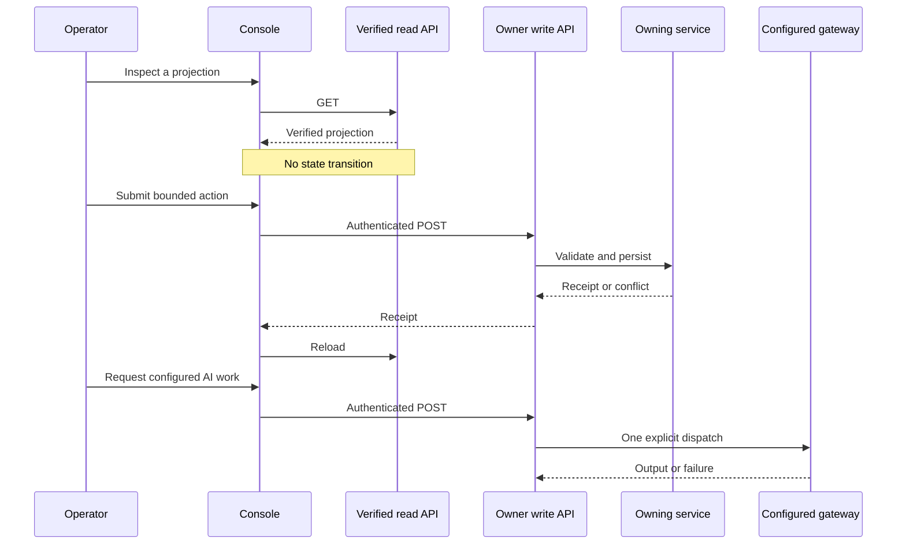

**Checked main SHA:** `2b44e4bcf75ac3bfd2a5d3a0de679a0fcb1a48ad`  
**Delivery standing:** The code behaviors documented here are **merged on main** at that SHA. This standing does not claim deployment, production configuration, or checks not run for this documentation update.

The operator application is a local console for reading verified projections and submitting bounded owner requests. It is not an authority engine: a rendered screen, a `GET` response, or generated material does not change state. The owning backend APIs and services below create, replay, and verify the records that establish state and authorization.

See also [Decisions and Authority](../operations/decisions-and-authority.md), [Runtime and Persistence](../operations/runtime-and-persistence.md), [Research Report Lifecycle](research-report-lifecycle.md), and [Verification and Replay](../testing/verification-and-replay.md).

## Boundary map

| Boundary | Owner and entrypoint | Meaning |
| --- | --- | --- |
| Verified read | [`src/api/workspace-api.ts`](../../src/api/workspace-api.ts), [`src/api/report-api.ts`](../../src/api/report-api.ts), and the Content Studio read API in [`src/api/content-api.ts`](../../src/api/content-api.ts) | Query-only connections reconstruct and verify artifacts before returning projections. A displayed state is not a decision. |
| Owner write | [`src/api/owner-api.ts`](../../src/api/owner-api.ts), the Content Studio owner API in [`src/api/content-api.ts`](../../src/api/content-api.ts), and owner-capable research routes in [`src/api/research-automation-api.ts`](../../src/api/research-automation-api.ts) | Authenticated `POST` handlers validate bounded input and call the owning Flow, governance, analysis, or Content service. The UI does not grant a capability. |
| External action | [`src/modules/flow/content-ai-attempt-service.ts`](../../src/modules/flow/content-ai-attempt-service.ts) and [`src/modules/analysis/research-automation/service.ts`](../../src/modules/analysis/research-automation/service.ts) | A configured gateway or provider is invoked only by an explicit service operation. Its output is retained material, evidence, or a draft—not an approval. |

[`openOperatorApp()`](../../src/api/operator-app.ts) always mounts the workspace, report, Content Studio, and research read sides; it mounts owner applications only when owner writes are enabled. It derives one loopback origin, validates the Host authority, requires a strong owner token and actor identity in normal owner mode, and keeps the executor lock and restart sweep with the owner-capable process. It also refuses a database that is not at migration head rather than migrating it at startup.

*The console reads and submits; the service owns the transition. A gateway call is a separate external-action boundary.*

## Workspace progression

[`DiscoveryWorkspaceService`](../../src/modules/flow/discovery-workspace-service.ts) snapshots and validates a create request, writes a canonical immutable workspace artifact, registers its manifest, and creates an `ACTIVE` workspace transactionally. A repeated `workspaceKey` is accepted only for the same request digest and content; changed content conflicts. `readWorkspace()` validates canonical bytes, manifest metadata, and the immutable row before returning the artifact.

The owner API composes the workspace progression rather than exposing a generic state setter:

1. It creates a discovery workspace and product candidates, including versioned candidate revisions.
2. It freezes a candidate basket at selected candidate versions; later revisions do not rewrite those members.
3. [`CandidateB7DecisionService`](../../src/modules/governance/candidate-b7-decision-service.ts) records a capability- and policy-bound `PASS`, `HOLD`, or `REJECT` on an exact basket member. [`ProductWorkspaceService`](../../src/modules/flow/product-workspace-service.ts) accepts only a replayed B7 `PASS` as the source for a product workspace.
4. The owner API invokes B8 lane decisions and a clearance, writes an optimistic-concurrency-controlled B9 working STP, locks that exact revision, and then records B10 decisions against the lock. These calls are assembled in [`src/api/owner-api.ts`](../../src/api/owner-api.ts).

[`openWorkspaceApi()`](../../src/api/workspace-api.ts) opens SQLite read-only with `query_only = ON`. Its routes replay workspace, candidate, basket, product, B8-clearance, B9, and B10 records and cross-check their identities and sequencing before exposing projections. A malformed request, absent record, or verification failure therefore does not become a client-side reconstruction; verification failures return a generic integrity error. A B10 `APPROVE` only makes the product workflow ready for B11—it does not itself publish, spend funds, or initiate an external action.

## Proposal, decision, and plan handoff

The generic proposal chain is service-owned and distinct from operator UI routing:

1. [`AnalysisBackedProposalService`](../../src/modules/orchestrator/analysis-backed-proposal-service.ts) reads a verified research-evidence audit, verifies that each evidence-link use agrees with its assessment, and persists an immutable `PROPOSED` proposal with source-audit and producer identity. Proposal versions must have their predecessor, and exact retries deduplicate only when identity matches.
2. [`GovernedProposalDecisionService`](../../src/modules/governance/governed-proposal-decision-service.ts) requires a trusted application-provided actor context containing `governance:proposal-review`. It records the actor and role snapshot, required capability, and policy version in an immutable decision. Legal transitions are `PROPOSED` to `APPROVED`, `REJECTED`, or `HOLD`, followed only by `HOLD` to `APPROVED` or `REJECTED`.
3. [`ApprovedProposalIntakeService`](../../src/modules/flow/approved-proposal-intake-service.ts) rereads the **current effective** decision. It creates an `AUTHORIZED_PLAN` only when the supplied decision ID is that exact current `APPROVED` decision for the supplied proposal, pinning proposal and decision digests, actor, policy, timestamp, and producer identity.

An authorized plan has the fixed next step `define_manual_tasks`; it is not a job, command, schedule, provider dispatch, or autonomous execution instruction. Proposed, held, rejected, stale, malformed, or mismatched decisions are rejected before plan persistence. This is the authorization boundary: analysis and model output may support a proposal, but only the governed decision and verified intake establish a plan.

## Report-review handoff

[`openReportApi()`](../../src/api/report-api.ts) is a query-only API. It reads verified report histories, version artifacts, interpretations, section readiness, and review targets. The report API cross-checks version metadata with the report packet and returns a generic integrity error if replay fails.

The authenticated `POST /owner-api/report-review-targets` handler in [`src/api/owner-api.ts`](../../src/api/owner-api.ts) calls [`ReportReviewTargetLedgerService`](../../src/modules/analysis/report-review-target-ledger.ts). That ledger deterministically builds a target from the exact report version, interpretation, and intended use; stores and registers canonical bytes transactionally; then rereads it before the receipt is returned. A subsequent read rebuilds the target and checks row identities, retained bytes, manifest metadata, and digest.

A review target packages a report, interpretation, rendered-report identity, and stated intended use for human review. It is not an approval and does not grant publication rights or transfer to another report version, interpretation, scope, use, or rendered file.

## Research automation and Content Studio

[`ResearchAutomationService`](../../src/modules/analysis/research-automation/service.ts) owns research-run lifecycle and provider work. `start()` first verifies the workspace, then creates a queued run and step records under the mutation mutex. Prepared uploads are inert staging operations: they require an exact run context, but do not themselves collect, admit evidence, or approve a report. The service also makes configured model features opt-in; for example, missing keyword-draft transport returns an explicit unavailable result rather than silently enabling a provider.

Content Studio read and owner routes are opened by [`src/api/content-api.ts`](../../src/api/content-api.ts), while AI dispatch and attempt lifecycle are owned by [`createContentAiAttemptService()`](../../src/modules/flow/content-ai-attempt-service.ts). The service validates preconditions, commits a `running` attempt before one gateway call, validates returned text or image data, stores and registers output bytes, and closes the attempt with dependent persistence. It records `succeeded`, `failed`, or `interrupted`; it does not automatically retry. A durable per-target running-attempt constraint prevents a second executor from dispatching the same live target.

Only an owner-capable operator obtains the executor lock and sweeps abandoned `running` attempts to `interrupted` at startup; a viewer does neither. Thus, Content Studio output and attempt receipts are auditable records, not approvals or independent authority.

## Operating expectations

- Owner writes require the owner-enabled application, bearer authentication, and the derived same origin. The local-test grant is process-scoped and ephemeral; it still requires same-origin, direct bearer-authenticated mutation requests and is not a production login mechanism. See [`src/api/operator-app.ts`](../../src/api/operator-app.ts).
- On conflict, reload the verified projection and reconsider the current state; do not alter and blindly retry a stale request. The owner API maps identity and optimistic-concurrency conflicts to `409` in [`src/api/owner-api.ts`](../../src/api/owner-api.ts).
- Treat integrity errors as closed boundaries. Do not recreate a workspace, approval, or report-review result from cached UI data or gateway output.
- A clean shutdown releases the executor lock only after managed applications close; uncertain shutdown retains it for manual recovery. [`src/api/operator-app.ts`](../../src/api/operator-app.ts) owns that rule.

## Focused verification

These integration tests exercise the boundaries described above; they are evidence of covered behavior, not a claim that this update ran them.

- [`tests/integration/workspace-api.test.ts`](../../tests/integration/workspace-api.test.ts) covers query-only reads, stable lineage projections, non-mutating reads, and generic failures for missing or corrupt artifacts.
- [`tests/integration/governed-proposal-review.test.ts`](../../tests/integration/governed-proposal-review.test.ts) covers capability checks, allowed transitions, immutable replay, deduplication, and stale or terminal chains.
- [`tests/integration/approved-proposal-intake.test.ts`](../../tests/integration/approved-proposal-intake.test.ts) proves that only the exact effective approval creates an `AUTHORIZED_PLAN`, rejects execution-like input fields, and detects replay tampering.
- [`tests/integration/operator-app.test.ts`](../../tests/integration/operator-app.test.ts) covers loopback routing, disabled-write behavior, derived origin and token controls, and the isolated local-test grant.
- [`tests/integration/content-ai-operator.test.ts`](../../tests/integration/content-ai-operator.test.ts) covers schema-head startup refusal, executor-lock ownership, viewer non-sweeping, and restart interruption recovery.

When extending this workflow, add the service-level transition, capability requirement, and replay checks first. Expose a UI control only after the owner API can invoke that verified operation, then reload its read projection.
