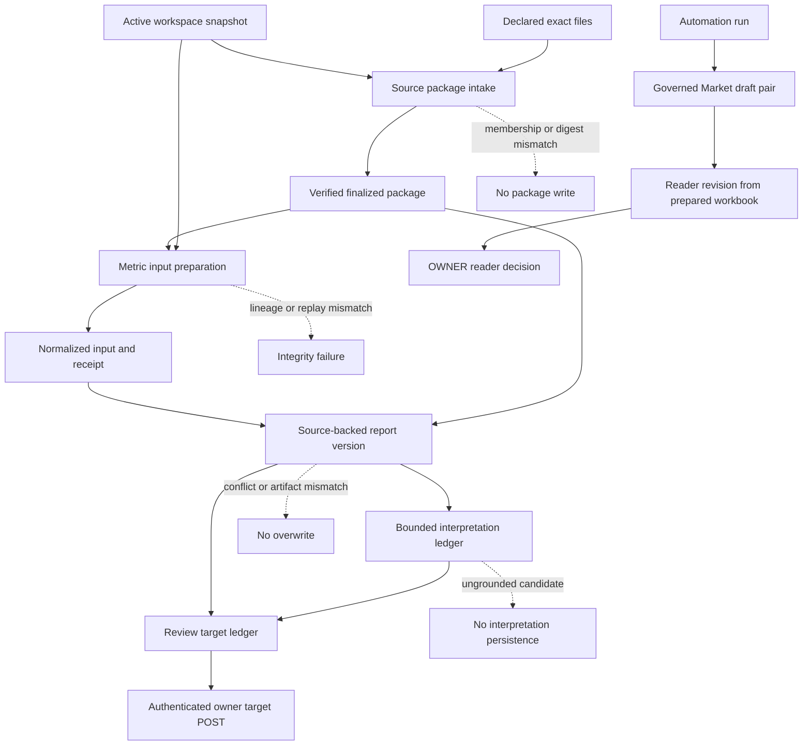

# Research-to-Report Lifecycle

## Scope, status, and authority

**Checked main SHA:** `2b44e4bcf75ac3bfd2a5d3a0de679a0fcb1a48ad`. The source-backed package, preparation, report-version, interpretation, review-target, and read/write API boundaries described here are merged on main. This does not establish collection, deployment, business acceptance, or an approval transition for a source-backed report. Historical PR #177 evidence, including merge `ad3d9e45bb28cbbea861550dac9e112e3616097c`, remains historical only.

The business-method authority is the [Ultimate Method](../../docs/research/ultimate-method/ultimate-method-30-sections.md): [rules 1–9](../../docs/research/ultimate-method/ultimate-method-30-sections.md#2-quy-tắc-dùng-chung-áp-cho-cả-30-section), [L1–L10](../../docs/research/ultimate-method/ultimate-method-30-sections.md#21-làm-rõ-khi-áp-cho-insight-mới-ở-v11), and [E1–E14](../../docs/research/ultimate-method/ultimate-method-30-sections.md#22-ngoại-lệ-đã-được-chủ-duyệt). This page documents only the bounded engineering path. [Thirty Report Sections](../concepts/thirty-report-sections.md) and the [Data Source Registry](../integrations/data-source-registry.md) distinguish implemented slices from the unproven remainder.

## Three non-interchangeable flows

*The upper path is the source-backed report ledger. The lower path is research automation: a run-bound draft pair and its separately versioned reader report are neither source-backed report versions nor review targets.*

## 1. Admit and verify a source package

`SourcePackageService.intake()` in [`src/modules/foundation/source-package-service.ts`](../../src/modules/foundation/source-package-service.ts) is the evidence-admission boundary. It validates the request and canonical logical paths, requires declared and supplied membership to match exactly, and verifies each byte length and SHA-256 before it stores content-addressed files. It records the canonical manifest, package-content identity, and member provenance metadata in an immutable finalized package.

The `(packageKey, version)` identity makes a repeated identical intake a verified, zero-mutation retry. Metadata or byte drift conflicts rather than replacing history. `readVerified()` reopens the manifest and all members, checks artifact metadata and canonical JSON, reconstructs the membership, and rechecks both request and package-content identities. A list or database row is therefore only an index; downstream evidence consumers must use a verified read. Optional read budgets reject an excessive member or total before reading it.

`intakeAutomationAttachment()` in the same service is deliberately narrower. Only its server-side caller can add the durable `AUTOMATION_ATTACHMENT` origin and binding SHA-256; an exact retry must reproduce that binding. Manual package inventory excludes marked attachments and `automation-method:` packages, although an exact-ID read still verifies them. This avoids presenting run-internal artifacts as manually selectable source packages.

| Boundary | Retained identity | Meaning |
| --- | --- | --- |
| Workspace | `workspaceId`, snapshot SHA-256 | The active scope used downstream |
| Package | `packageId`, manifest SHA-256, package-content SHA-256 | Immutable supplied evidence membership |
| Member | logical path, SHA-256, size, media type, provenance fields | Exact source byte and declared context |
| Automation attachment | binding SHA-256 plus `AUTOMATION_ATTACHMENT` origin | Internal run attachment, not manual inventory |

## 2. Freeze Metric inputs before report assembly

`MetricInputPreparationService.prepare()` in [`src/modules/analysis/metric-input-preparation-service.ts`](../../src/modules/analysis/metric-input-preparation-service.ts) accepts one explicit workbook, manifest, and optional labels selection. Its build path reads the workspace and finalized package through their verified readers; requires an active workspace and matching snapshot/package identities; selects the expected roles and media types; checks distinct paths and normalized evidence-family constraints; then normalizes the exact supplied bytes.

The preparation identity covers the canonical request, workspace snapshot, package identities, selected-source provenance, normalized-input digest, and normalization-receipt digest. The service retains canonical normalized input, receipt, and result artifacts, materializes the normalized-observation projection in the same mutex-protected transaction, and verifies the persisted result before returning. An identical preparation is deduplicated with zero database mutations.

`readVerified()` is the replay boundary: it rebuilds from the retained request’s exact package selection and workspace, requires result/input/receipt byte equality, and verifies the projection against normalized input. Changed source bytes, noncanonical or missing artifacts, workspace/snapshot drift, incompatible selection, or a projection mismatch therefore fails closed rather than substituting newer data.

`ReportGenerationService` in [`src/modules/analysis/report-generation-service.ts`](../../src/modules/analysis/report-generation-service.ts) is a selection adapter, not the owner of preparation or report history. `inputs()` permits choices only after it verifies an `ACTIVE` workspace and enumerates verified manual packages. `create()` prepares first, rejects invalid label coverage, evaluates readiness, and either retains the M03 section artifact and creates a prepared version or creates the narrower source-backed version with explicit limitations. Its request-key retry reopens the committed workspace, package, source selection, and saved request rather than rediscovering current inventory.

## 3. Persist an immutable source-backed report version

`ReportVersionService` in [`src/modules/analysis/report-version-service.ts`](../../src/modules/analysis/report-version-service.ts) owns source-backed report series and versions. `createVersion()` assembles the base source-backed profile and optional descriptive, located-Insight, and method-packet extensions. `createPreparedVersion()` builds the prepared profile using verified preparation, readiness, and retained section artifacts. Both pin catalog bytes, canonicalize the request, stage content-addressed artifacts, and commit version metadata, artifact membership, and selected-source membership in one transaction.

A version starts with `interpretationState: 'NONE'` and `reviewState: 'UNREVIEWED'`. Its record binds the series/version identities and predecessor semantic ID to workspace snapshot, package manifest/content identities, semantic and review digests, selected sources, and the complete artifact set. The set includes the create request, evidence envelope, semantic content, review state, rendered `report.html`, and export manifest. Prepared versions additionally retain the assembly, preparation/readiness outputs, and M03 record and members. Presentation can change rendered HTML without changing semantic identity; prior retained bytes continue to replay under their saved profile.

### Replay, retries, and failures

`readVersion()` reconstructs the saved request through its original profile, rereads every registered artifact, checks exact artifact membership and bytes, revalidates workspace/package/source lineage, and validates the predecessor chain. `readArtifact()` invokes that complete version verification before returning one member. There is no implicit “latest” report reader: callers provide an explicit version.

An exact create retry returns the existing version with `deduplicated: true` and no database mutation. If exact, expected publication bytes are missing, retry may republish those bytes without changing the database; corrupt retained bytes are an integrity error and are never overwritten. Changed request bytes for an occupied version, a bad pinned catalog, a wrong predecessor, out-of-sequence versioning, or membership drift fails rather than mutating report history.

## 4. Retain an interpretation without upgrading evidence or approval

`ReportInterpretationLedgerService.persist()` in [`src/modules/analysis/report-interpretation-ledger.ts`](../../src/modules/analysis/report-interpretation-ledger.ts) does not call a model. An upstream bounded-generation path supplies candidate artifact bytes and the exact prompt text. The ledger first obtains `ReportVersionService.readInterpretationSource()` and deterministically rebuilds the candidate against that exact report bundle.

A retained interpretation binds report/version and source semantic version, packet and claims identities, prompt SHA/artifact, provider/model/prompt identifiers, output-schema version, optional telemetry, and completion time. Both prompt and interpretation are content-addressed. A post-write verified read is required; an identical retry is mutation-free, while bytes that differ under the same interpretation identity conflict.

On `read()` and `list()`, the ledger validates manifests, digests, canonical artifact bytes, prompt digest, report-version binding, and deterministic reconstruction. A missing/corrupt artifact, a wrong report version, a mismatched prompt, or unreplayable source evidence is rejected. The bounded interpretation builder only accepts eligible sections and retained packet claims, preserves citations, assumptions, limitations, and provenance, and rejects unsupported sections, invented claims, ungrounded numeric literals, and decision or authority language. An interpretation is neither source evidence nor a transition out of `UNREVIEWED`.

## 5. Compose a review target; target creation is not approval

`ReportReviewTargetLedgerService.create()` in [`src/modules/analysis/report-review-target-ledger.ts`](../../src/modules/analysis/report-review-target-ledger.ts) combines exactly one report version, one persisted interpretation for that version, and an `intendedUse`. Its deterministic target includes report/version and semantic identities, interpretation content identity, rendered-report SHA-256, cited claim IDs, selected source identities, and scope. It is retained as a content-addressed JSON artifact and row; `read()` rebuilds it from the exact report and interpretation and compares canonical bytes.

The ledger deduplicates an exact target and conflicts on changed content at the same target identity. Forged report-version linkage, unavailable cited claims, or a changed rendered-report identity fails closed. Creating a target does not edit the report or interpretation and does not change source-backed report review state.

`POST /owner-api/report-review-targets` in [`src/api/owner-api.ts`](../../src/api/owner-api.ts) is the write entrypoint for this package. It accepts only POST, validates the bounded JSON shape and body size, requires bearer authentication, and restricts browser origins to configured `allowedOrigin`; it rereads the target before returning its receipt. The target endpoint authenticates target creation, not a source-backed report approval.

[`src/api/report-api.ts`](../../src/api/report-api.ts) is the complementary read boundary: it opens SQLite read-only with `query_only = ON`, accepts GET only, and exposes verified report histories, section readiness, interpretations, targets, and individual version artifacts. Any failed verified read returns an integrity error rather than an unverified projection.

## Do not confuse this ledger with research automation

Research automation has a different state owner and authority model:

- A governed Market automation report is a run-bound draft pair, produced from retained run scope, collection, source, and method state. It is not a `ReportVersionService` report version. See [`src/modules/analysis/research-automation/service.ts`](../../src/modules/analysis/research-automation/service.ts) and [Market Report Lanes](../concepts/market-report-lanes.md).
- `AutomationReaderReports` in [`src/modules/analysis/research-automation/reader-report-revisions.ts`](../../src/modules/analysis/research-automation/reader-report-revisions.ts) builds an OWNER-facing reader page only from a `DRAFT_READY` run, its verified Market draft pair, and the run-bound prepared workbook. The build does not edit the draft, admit a source, call a provider, or wake the worker.
- Reader pages are sequential immutable revisions, not report versions or review targets. An undecided latest revision is `PENDING_OWNER_REVIEW`; an older undecided revision is `SUPERSEDED`; an append-only OWNER decision projects `APPROVED` or `REJECTED`. Only the newest revision can be decided, and a new build is refused after the latest revision is approved.

Thus, a source-backed review target packages a particular immutable report/interpretation pair for human review, while an automation reader decision applies only to its own reader revision. Neither establishes approval of the other lane.

## Operating and change checklist

1. Start from a verified active workspace and finalized package, and preserve their IDs/digests in downstream requests.
2. Treat source/package, normalization, catalog, semantic, renderer, and artifact-membership changes as replay-sensitive changes; do not repair corrupt historical bytes.
3. For preparation changes, cover exact selection, receipt/input/result replay, projection matching, and invalid versus missing readiness.
4. For version changes, cover both profiles, predecessor sequencing, historical renderer dispatch, exact retries, missing-publication recovery, and corrupt-artifact refusal.
5. For interpretations and targets, cover version/prompt/claim bindings, deterministic rebuilds, ungrounded-output rejection, and target composition.
6. For automation reader changes, separately preserve ready-run/workbook binding, immutable revision sequencing, and decision semantics; do not merge them into the source-backed ledger.

Focused coverage: [`tests/integration/source-package-intake.test.ts`](../../tests/integration/source-package-intake.test.ts), [`tests/integration/prepared-report-version.test.ts`](../../tests/integration/prepared-report-version.test.ts), [`tests/integration/report-version-service.test.ts`](../../tests/integration/report-version-service.test.ts), [`tests/unit/report-interpretation.test.ts`](../../tests/unit/report-interpretation.test.ts), and [`tests/unit/report-review-target.test.ts`](../../tests/unit/report-review-target.test.ts). They use synthetic fixtures. See [Verification and Replay](../testing/verification-and-replay.md) for the broader procedure and [Operator Workspaces, Owner APIs, and Approval Handoffs](operator-workspaces-and-approval.md) for operator controls.

## Related pages

- [Market Report Lanes](../concepts/market-report-lanes.md) — governed automation drafts and reader revisions.
- [Thirty Report Sections](../concepts/thirty-report-sections.md) — current bounded delivery by section.
- [Data Source Registry](../integrations/data-source-registry.md) — approved sources versus wired collectors.
- [Quickstart](../quickstart.md) — local operating entry points.
- [Verification and Replay](../testing/verification-and-replay.md) — replay and focused test guidance.
- [Operator Workspaces, Owner APIs, and Approval Handoffs](operator-workspaces-and-approval.md) — authenticated mutation boundary.
