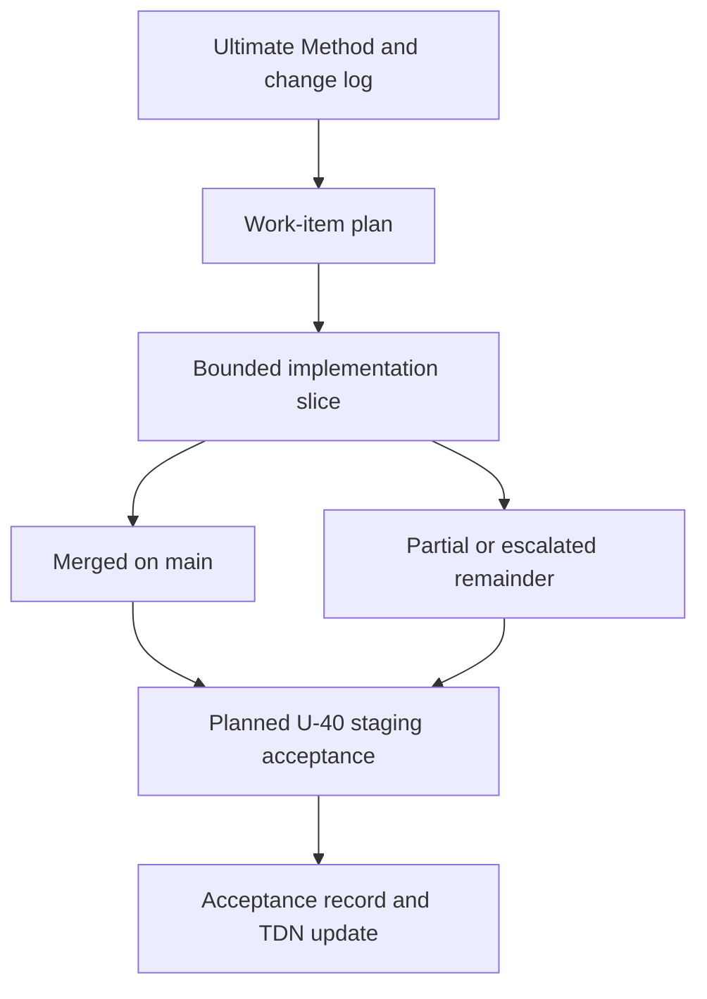

# Ultimate Alignment Packages and Sync Plan

**Checked main:** `2b44e4bcf75ac3bfd2a5d3a0de679a0fcb1a48ad`. This is a coordination view, not the business-method specification: the [Ultimate Method](../../docs/research/ultimate-method/ultimate-method-30-sections.md) and its [change log](../../docs/research/ultimate-method/CHANGELOG.md) define business authority. The status ledger and package handoffs establish only the bounded scope that merged. A merge, a green historical check, or a source-board card does not establish deployment, full alignment, live acceptance, or a live source call.

## How to read package status

`U-*`, `P*`, `B-*`, and `SYNC-*` are work-item identifiers, not business rules. This page uses **merged on main**, **open PR**, and **planned** literally; a package can be merged while its related work item remains partial or escalated.

*Business authority, bounded implementation, and acceptance remain separate gates.*

The report lanes keep that separation in code: the automation draft renders retained run and method state, while the Market Reader Report is a separate, revisioned owner-facing surface and does not admit sources or alter the draft. See [Market Report Lanes](../concepts/market-report-lanes.md) and [Research Report Lifecycle](research-report-lifecycle.md).

## Merged packages: bounded scope

The status ledger records the following packages as merged historical evidence. PR numbers and merge commits identify those delivered slices; they are not the checked-main reference above.

| Package | Bounded capability now represented | Explicit remainder |
| --- | --- | --- |
| SYNC-6 / PR #161 | The registry-driven, read-only source board has 11 cards, configured caps, stored workspace activity, future-package placeholders, and distinct PageIndex account/workspace views. | A card does not wire a collector. Future activity readers and activation remain with their source packages. |
| SYNC-1 / PR #162 | The Market reader preserves missing values and platform partitions, uses neutral wording for the corrected sections, and keeps legacy semantics replayable. | Positive multi-platform aggregation remains escalated as U-32. |
| SYNC-5 / PR #163 | The L9 core is a versioned, deterministic classification boundary. | It did not connect every keyword collector, disclosure, or consumer. |
| SYNC-3 / PR #164 and SYNC-4 / PR #166 | Versioned working-question/default and labelled draft-count paths are available in their stated Insight scope. | Release eligibility and the cross-check are not supplied by draft display. |
| SYNC-2 / PR #167 | A deterministic, source-backed default-peer set can be frozen before discovery or sales reads. | Scope revision, recollection, admission, and automated collection policy remain U-26. |
| NEXT-INSIGHT / PR #174 | Versioned I04–I09 family drafts and the I11 count bridge are present. | Draft rates/differences, buyer-type evidence, receipt-free UI, and U-11 release eligibility are not claimed. |
| NEXT-MARKET / PR #175 and spec intake / PR #177 | An opt-in Market reader path supports scoped findings, retained-spec unit prices, shared visible-text lint, and authenticated listing-spec intake. | Native extraction, automatic report integration, and confirmed ROAS/CPA field provenance remain follow-up work. |
| NEXT-SOURCES / PR #172 | Retained keyword drafting for authenticated sales names, L9 admission for the existing web lane, M13/I17 registry disclosure, and renderer v18 are present. | Metric-only drafting, other mappings, and not-yet-built collectors/consumers remain partial. |

For the exact reviewed heads, historical checks, and merge records, consult [`docs/STATUS.md`](../../docs/STATUS.md) rather than treating this summary as an audit ledger.

## Implementation boundaries that matter

### L9 admission is deterministic and retained ([`src/modules/analysis/keyword-meaning-filter.ts`](../../src/modules/analysis/keyword-meaning-filter.ts))

`filterKeywordMeanings` validates versioned keyword/exclusion data and unique record identities, then classifies each record as `INCLUDED`, `EXCLUDED`, or `UNCLEAR`. Exclusions take precedence; matching preserves Vietnamese diacritics; an unaccented candidate needs context to become included. The returned frozen result retains source text, reasons, versions, and exclusion/unclear accounting. It performs no I/O, provider, model, or random operation. Consumers must use the included set before publishing counts or quotations; the core alone is not evidence that every collector is connected.

### Insight drafts retain provenance and do not promote authority ([`src/modules/analysis/located-insight-methods.ts`](../../src/modules/analysis/located-insight-methods.ts))

Located Insight validation requires source membership, readable-span integrity, included-record membership, and internally consistent provenance before it builds section outputs. Current semantics can add labelled draft counts, but pending AI coding or disagreement remains distinct from accepted coding. `verifyLocatedInsightMethods` rebuilds from the retained input and rejects a canonical-output mismatch, which is the replay boundary for this method—not proof of business acceptance.

### Reader output remains platform-aware and fail-closed ([`src/modules/analysis/reader-report/build.ts`](../../src/modules/analysis/reader-report/build.ts))

For current reader input versions, `computeReaderReportData` uses per-platform scopes and reconciliation; legacy inputs retain their historical branch. `publishReaderReport` runs lint and rejects failed lint, hardcoded narrative numbers, or numbers absent from the metric bundle before writing HTML, metrics, or claims artifacts. These gates protect a reader build; they do not resolve U-32 or approve a report.

## Remaining work and dependency boundaries

Three program-level work items remain explicitly escalated:

- **U-11:** independent second-model, multi-code Cohen’s κ and the resulting release eligibility.
- **U-26:** revision, recollection, source admission, cap/usage, retry, and automatic-collection policy across retained report history.
- **U-32:** proof that platform totals have compatible timezone, universe, unit, and disjointness before a positive aggregate can be displayed.

The source-bound remainder is planned rather than implied by the board: **P5** connects Trends and expanded search with its L9/call-budget boundary; **P6** is the Metric/OpenCLI capture path; **P7/U-20** covers customer-voice cards and personas; **P9/U-19** covers TikTok comments and video-reading intake; **P10/U-24** covers official-statistics and World Bank intake; and **U-23** covers Meta Ad Library. **U-27**, **U-28**, **U-29**, **U-33**, and **U-34** retain appendix, Insight reader, Market conclusion, advertising-provenance, and broader unit-price work respectively. The source board is a visibility surface, not evidence that these collectors operate; see [Data Source Registry](../integrations/data-source-registry.md).

The package documents contain a historical dependency/serialization map for shared schemas, generated outputs, service integration, migrations, and renderer dispatch. Treat it as coordination evidence, not a standing exclusive-writer instruction: consult the current package plan and ownership records before changing a shared surface.

## Acceptance is separately planned

**U-40 is planned, not executed or authorized by these package merges.** Its proposed acceptance reruns coconut jelly, thermos, and handheld-fan cases on a staging copy within configured collection caps, recording section-level pass/fail evidence in a dated artifact. Synthetic fixtures, deterministic replay, and historical hosted checks are technical evidence only; they do not demonstrate real-source breadth, coding quality, or business usefulness.

An acceptance record should name the checked main SHA, retained case inputs, applicable rule IDs, inspections/tests performed, failures, and unresolved decisions. **U-41** can update corresponding TDN records only after that evidence exists. For test selection and replay boundaries, see [Verification, Contracts, and Deterministic Replay](../testing/verification-and-replay.md).

## Change guide

1. Begin with the Ultimate rule and change-log lineage, then locate its U/P/B work item in the [sync plan](../../docs/tasks/ultimate-v1.11-tdn-sync-plan.md).
2. Preserve versioned input/output semantics and retained artifacts; do not silently reinterpret historical reports.
3. Follow the current ownership record for shared paths and test the smallest boundary crossed—contract, pure method, replay/service, API, or UI.
4. Report the result as merged on main, open PR, planned, partial, or escalated. Do not upgrade a plan, test fixture, or board state into deployment or acceptance.
